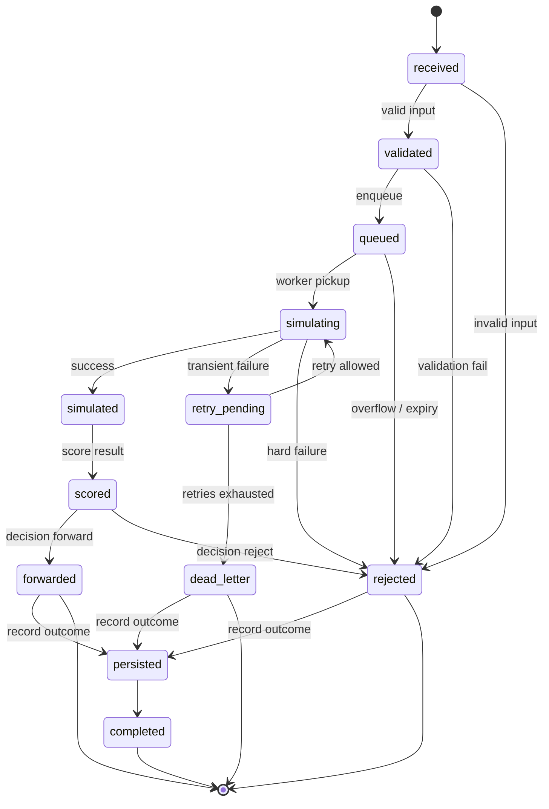
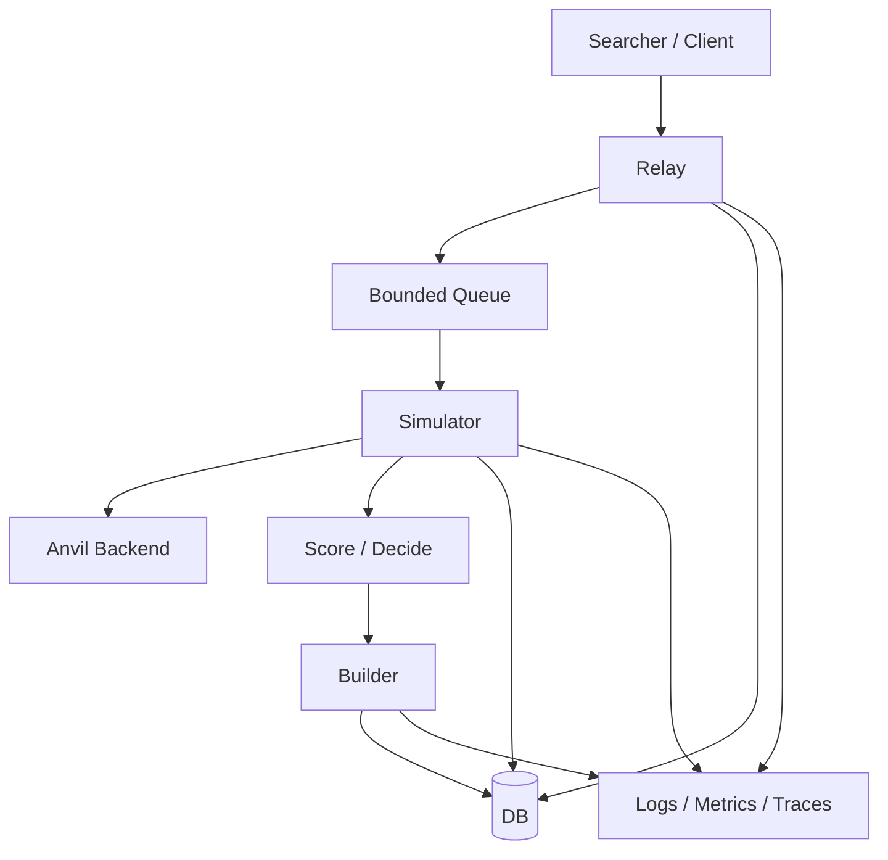
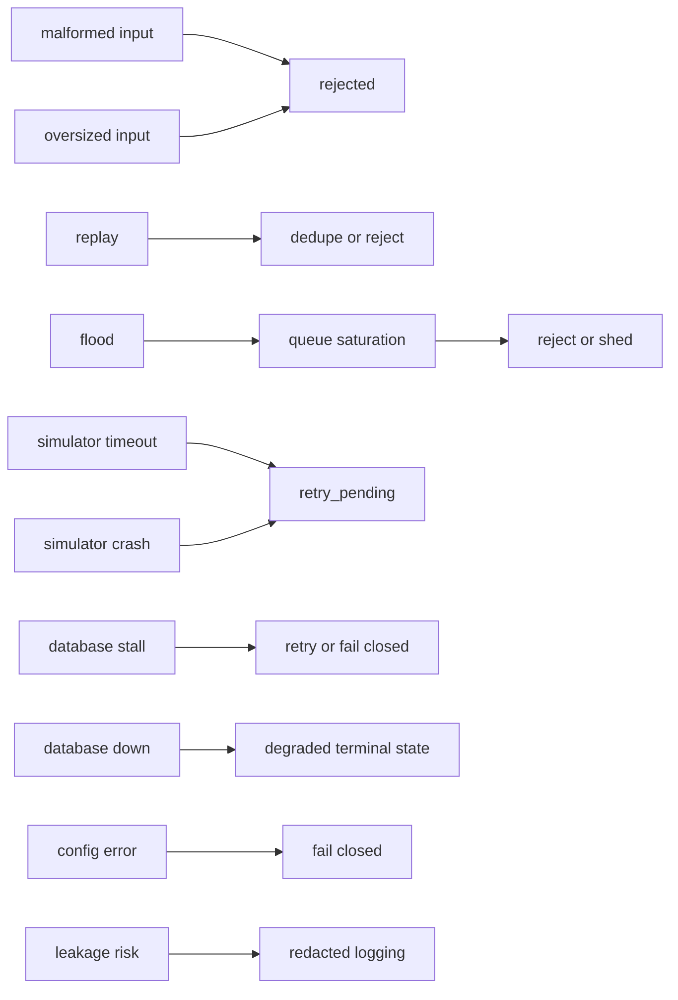
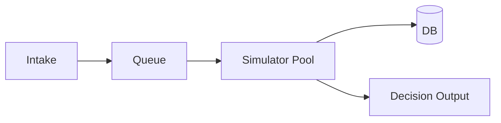
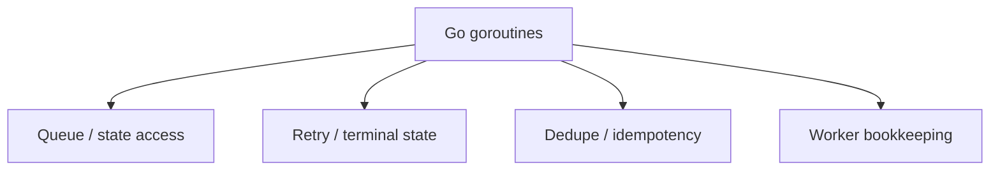

# MEV Relay v1

v1 proves the relay loop under bounded adversarial load:

1. accept a bundle
2. validate it
3. queue it
4. simulate it on Anvil
5. score it
6. persist the result
7. return a clear decision

## Scope

**Included**

- public bundle submission
- request validation
- tracking ID assignment
- bounded queueing
- simulator worker execution
- Anvil as the default execution backend
- scoring and decision output
- storage of submissions and simulation results
- audit logging
- metrics and logs

**Not included**

- live mainnet relay connectivity
- microservices
- production HA
- validator integrations
- complex auction logic
- customer auth systems beyond basic request validation
- multi-region infrastructure

## Functional Requirements

- accept a bundle submission
- validate the request shape and required fields
- assign a tracking identifier
- enqueue the bundle for simulation
- execute the bundle against the configured backend
- capture simulation outcome and timing
- compute a score or decision
- persist the request, state, and result
- expose status
- reject malformed or unsupported input safely

## Non-Functional Requirements

- reliability: terminal outcomes are correct and durable
- predictability: the same input follows the same valid transition rules
- boundedness: queues, retries, and simulation time stay within limits
- resilience: hostile input and backend failure do not break the lifecycle
- simplicity: the system stays understandable in one codebase
- feasibility: the design fits Docker Compose and Anvil-first execution
- security: unauthorized or malformed input fails closed
- trust boundaries: the HTTP edge owns transport identity; internal calls do not accept caller-supplied identity as auth
- privacy: bundle contents do not leak into logs or traces
- observability: state, latency, and failure mode are visible
- operability: failures are recoverable by an operator without guesswork
- health: `/healthz` and `/readyz` report healthy, degraded, or unsafe state explicitly
- performance: hot-path work stays within explicit time budgets

## Formal Model

The system is modeled as four directed graphs:

- `G_life` for bundle lifecycle
- `G_deploy` for Compose topology
- `G_fail` for hostile and operational failure paths
- `G_cap` for capacity and pressure

`M = (G_life, G_deploy, G_fail, G_cap, I, Gg)`

Where:

- `I` = invariants
- `Gg` = guarantees

### Quantified variables

- `Qmax` = max queue depth
- `Rmax` = max retries per bundle
- `Tsim_max` = max simulation time per attempt
- `Tretry_max` = max cumulative retry time
- `Tdb_max` = max DB write time
- `Csim` = simulator concurrency
- `Cdb` = DB write capacity
- `Cin` = intake rate
- `Cout` = terminal decision rate

### Constraints

- `queue_depth <= Qmax`
- `retry_count <= Rmax`
- `simulation_time <= Tsim_max`
- `retry_time <= Tretry_max`
- `db_write_time <= Tdb_max`
- `throughput <= min(Cin, Csim, Cdb, Cout)`

## Bundle Lifecycle Graph

### States

- `received`
- `validated`
- `queued`
- `simulating`
- `simulated`
- `scored`
- `retry_pending`
- `dead_letter`
- `forwarded`
- `rejected`
- `persisted`
- `completed`

### Invariants

- `received` precedes `validated`, which precedes `queued`, which precedes `simulating`, which precedes `simulated`, which precedes `scored`
- terminal states have no normal outgoing edges
- retries remain inside the bounded retry subgraph
- invalid input cannot reach `simulating`
- every terminal bundle has a durable record
- persisted outcome matches the final decision

## Deployment Graph

### Compose nodes

- relay
- simulator
- builder
- database
- anvil
- observability

### Deployment edges

- `relay -> simulator`
- `simulator -> anvil`
- `relay -> database`
- `simulator -> database`
- `builder -> database`
- `relay -> observability`
- `simulator -> observability`
- `builder -> observability`

## Failure Graph

### Failure nodes

- malformed input
- oversized input
- replay
- flood
- queue saturation
- simulator timeout
- simulator crash
- database stall
- database down
- config error
- leakage risk
- restart loop

### Failure rules

- malformed input -> rejected
- oversized input -> rejected
- replay -> rejected or deduplicated
- flood -> queue saturation
- queue saturation -> rejected or shed
- simulator timeout -> retry_pending
- simulator crash -> retry_pending
- database stall -> retry or fail closed
- database down -> fail closed or degraded terminal state
- config error -> fail closed
- leakage risk -> redacted logging and scoped tracing

## Capacity Model

### Capacity variables

- `Cin` = intake rate
- `Qmax` = queue depth
- `Csim` = simulator concurrency
- `Cdb` = DB write capacity
- `Cout` = decision throughput

### Bottleneck rule

- total throughput is bounded by `min(Cin, Csim, Cdb, Cout)`
- queue overflow must be explicit
- retries must be bounded

## Risk Matrix

| Limit | Resource risk | Adversarial trigger | Business impact | Mitigation |
|---|---|---|---|---|
| `Qmax = 1,000` | Memory growth and queue poisoning | Burst of valid-looking junk bundles | Good bundles get delayed or rejected; relay loses useful flow | Hard queue cap, reject-fast admission, per-client inflight cap, queue depth metrics |
| `Rmax = 3` | Retry amplification and worker churn | Transient backend failures intentionally triggered or naturally induced | Extra compute and DB load; delayed terminal outcomes | Bounded retries, exponential backoff, dead-letter after max retries |
| `Tretry_max = 15s` | Retry limbo consumes lifecycle capacity | Repeated timeouts or backend flapping | Request backlog grows; recovery becomes noisy | Total retry deadline, terminal failure after budget exhaustion |
| `Tsim_max = 2s` | Simulator saturation and tail latency blow-up | Bundles crafted to hit expensive paths | Lost inclusion opportunity; low throughput; CPU pressure | Per-bundle timeout, cancellation, worker pool limit, reject on repeated timeout |
| `Tdb_max = 500ms` | DB becomes a bottleneck on terminal writes | High failure rate causes many terminal writes or slow disk | Audit lag, backpressure, incomplete visibility | Fast DB timeout, minimal failure record, async non-critical metrics, bounded pool |
| Payload max `256 KiB` | Parse and memory pressure | Oversized calldata or bundle payloads | Excess resource burn; parsing overhead; possible leakage risk | Hard request size limit, reject at ingress, no raw payload logging |
| Max txs per bundle `32` | Simulation cost variance | Many-tx bundles crafted to maximize work | Simulator slowdown and reduced throughput | Hard tx cap, pre-validation, reject over-cap bundles |
| `Csim = 4` per container | CPU contention and unstable latency | Many concurrent valid requests, or adversary bursts | Tail latency spikes; simulator host thrash | Fixed worker pool, backpressure, queue cap, container resource limits |
| Per-client inflight cap `20` | One client monopolizes capacity | Single client floods with many in-flight requests | Fairness loss; legitimate traffic delayed | Client-level quota, rate limit, explicit rejection on quota breach |
| Log retention `7 days` | Storage growth and observability cost | High traffic or abuse generates heavy logs | Disk pressure, slower ops, higher infra cost | Log rotation, redaction, structured logs only, retention policy |
| Audit retention `30 days` | Storage growth over time | Sustained traffic, incident replay demands, or abuse | Storage cost, index bloat | Partitioned tables, retention jobs, compressed archival if needed |

## Pressure Behavior

| Condition | Behavior |
|---|---|
| Queue full | Reject fast |
| Simulator saturated | Stop admission or shed load |
| DB slow | Fail closed for terminal persistence; write minimal failure record if possible |
| Backend timeout | Retry only within budget |
| Retry budget exhausted | Dead-letter |
| Client floods relay | Rate limit and cap inflight work |
| Payload too large | Reject at ingress |
| Bundle invalid | Reject before queueing |

## Guarantees

- safety: illegal states are unreachable
- boundedness: queue growth, retry depth, and simulation time are bounded
- liveness: valid bundles reach a terminal state
- recoverability: restart does not invalidate terminal records
- containment: failure in one component does not corrupt the lifecycle

## Health Model

- `healthy`: store and backend are reachable, and the queue has headroom
- `degraded`: the relay is operating, but queue pressure is elevated
- `unsafe`: the relay must not accept work because a critical dependency is down or the queue is full
- `/healthz` returns the current health report
- `/readyz` fails closed when the report is `unsafe`

## Race Model

| Race | Risk | Mitigation | Decision cost | Alternative |
|---|---|---|---|---|
| Queue/state access | Duplicate processing, stale reads | Single owner, locked transition path, atomic state write | More coordination around state updates | Actor model per bundle |
| Retry vs terminal state | Conflicting terminal truth | Transition guards, compare-and-swap state write, one terminal state | Slightly stricter state handling | Treat retries as separate job IDs |
| Dedupe vs insert | Duplicate acceptance | Atomic insert-or-reject, unique constraint, idempotency key | DB constraint dependency | In-memory dedupe cache plus DB fallback |
| Worker bookkeeping | Wrong in-flight count, lost job tracking | Mutexed registry or channel ownership | More locking or serialization | Stateless workers with external tracking |
| Counter / map updates | Data race in metrics/bookkeeping | Atomics for counters, mutex for maps | Slight implementation overhead | Single metrics aggregator goroutine |

### v1 rule

- one owner for mutable bundle state
- no unbounded goroutine fan-out
- no terminal-state ambiguity
- dedupe must be atomic

## Reality Audit

### Ingress

Survives:

- strict validation
- payload size caps
- fail-closed rejection

Breaks if:

- schema checks are loose
- signatures are optional
- invalid input reaches the queue

Fix:

- validate before enqueue
- reject on missing or malformed fields
- enforce per-client caps

### Lifecycle

Survives:

- explicit states
- terminal outcomes
- bounded retries

Breaks if:

- a bundle can skip states
- retries are unbounded
- terminal state is ambiguous

Fix:

- enforce transition guards
- persist state changes
- dead-letter after retry budget exhaustion

### Simulation

Survives:

- bounded execution time
- worker pool limits
- backend abstraction

Breaks if:

- simulation is non-deterministic
- workers block indefinitely
- backend errors are merged with bundle errors

Fix:

- hard timeout per attempt
- separate backend and bundle failure classes
- cancel work on timeout

### Persistence

Survives:

- durable terminal records
- bounded DB writes
- explicit failure handling

Breaks if:

- DB is required for every hot-path decision
- writes block indefinitely
- partial writes create ambiguous state

Fix:

- bound write time
- store minimal failure records
- keep terminal state consistent with persisted state

### Deployment

Survives:

- Docker Compose topology
- local service boundaries
- health and readiness checks

Breaks if:

- startup order is assumed
- service restarts are not handled
- network calls are treated as free

Fix:

- define health checks
- tolerate restart
- treat every container boundary as a failure boundary

### Observability

Survives:

- structured logs
- queue depth metrics
- latency metrics
- redacted payload handling

Breaks if:

- raw bundle data leaks into logs
- terminal states are not visible
- metrics are missing at the failure boundary

Fix:

- log metadata, not payloads
- emit state transitions
- record per-stage latency

## Decision Cost

### Keep

- in-process state machine
- bounded queue
- hash-based dedupe
- append-only records

### Cost

- limited concurrency without a broker
- stronger transition discipline
- careful locking around shared state

### Alternative

- brokered dispatch
- partitioned workers
- external state coordinator

## v1 Test Plan

This test plan covers lifecycle, failure handling, persistence, and backend selection.

### 1. Request Validation

Bad submissions are rejected before queueing.

Cases:

- missing `txs`
- empty `txs`
- malformed transaction payload
- missing `block_target`
- invalid `block_target` format
- missing signature
- invalid signature format
- unsupported fields
- oversized payload

Expected:

- request is rejected
- response is clear and stable
- no queue item is created
- no simulation is triggered
- rejection is logged without leaking bundle contents

### 2. Submission Identity

Each accepted bundle gets a stable identity.

Cases:

- first submission of a bundle
- repeated submission of the same bundle
- repeated submission after restart

Expected:

- tracking ID is assigned once
- duplicate handling is consistent
- transport identity is derived at the HTTP edge, not from a caller-supplied field
- idempotency behavior is defined
- stored records can be correlated with logs and metrics

### 3. Queue Behavior

The queue must behave safely under load.

Cases:

- single bundle enqueue
- burst of bundles
- queue at capacity
- queue overflow
- worker unavailable
- queue drain after backlog

Expected:

- queue accepts normal traffic
- bounded capacity is enforced
- overflow is handled by a defined policy
- no silent loss of accepted work
- queue depth is observable

### 4. Simulation Execution

Bundles execute against Anvil.

Cases:

- valid bundle with successful execution
- valid bundle with revert
- valid bundle with gas-heavy path
- bundle with unsupported transaction shape
- bundle targeting an invalid block height
- bundle simulated after fork reset

Expected:

- simulation result is captured
- timing is recorded
- success or failure is explicit
- backend errors are separated from bundle errors
- result storage is consistent with the observed execution

### 5. Scoring and Decisioning

The relay produces a decision from simulation output.

Cases:

- profitable bundle
- unprofitable bundle
- bundle with neutral outcome
- bundle with simulation failure
- bundle with missing profitability signal

Expected:

- decision is one of accept, forward, or reject
- score is explainable
- decision is persisted
- decision is visible in logs and metrics

### 6. Persistence

Results are stored correctly.

Cases:

- submission persisted before simulation completes
- simulation result persisted after success
- rejection persisted after validation failure
- restart after partial write

Expected:

- records survive process restart
- stored state matches the relay outcome
- partial failure does not corrupt prior records
- database errors are handled explicitly

### 7. Observability

The system remains observable during operation.

Cases:

- successful request path
- validation failure path
- queue overflow path
- simulation failure path
- backend unavailable path

Expected:

- structured logs contain bundle ID or tracking ID
- sensitive payload data is redacted
- metrics expose request count, queue depth, simulation latency, and decision counts
- health and readiness endpoints reflect service state

### 8. Failure Handling

Failure is bounded.

Cases:

- simulator crash
- queue saturation
- database unavailable
- backend timeout
- malformed runtime config
- process restart mid-flight

Expected:

- failures are visible
- work is retried only when safe
- dead-letter or overflow behavior is defined
- the relay does not hang indefinitely
- operators can recover the system

### 9. Privacy and Leakage

Bundle contents do not leak unnecessarily.

Cases:

- normal request path
- validation failure
- simulation failure
- debug logging enabled
- metrics export

Expected:

- transaction payloads are not blindly printed
- logs carry metadata, not raw sensitive content
- tracing is scoped
- storage only retains what the product needs

### 10. Backend Swappability

The chain backend can be switched without rewriting relay logic.

Cases:

- default Anvil backend
- forked Anvil backend
- live RPC backend stub
- invalid backend config

Expected:

- relay logic stays the same
- backend is selected by configuration
- invalid config fails fast
- tests can run without live chain access

## Test Layers

- unit tests for validation, scoring, queue policies, and state transitions
- integration tests for relay to simulator to persistence
- happy-path end-to-end tests
- failure-path end-to-end tests
- restart and recovery tests
- backend adapter tests for Anvil and stubbed RPC behavior

## Exit Criteria For v1

v1 is done when:

- a bundle can move through the full relay loop
- failures are explicit and bounded
- simulation on Anvil works consistently
- results are persisted and observable
- the codebase is still simple enough to extend into v2
