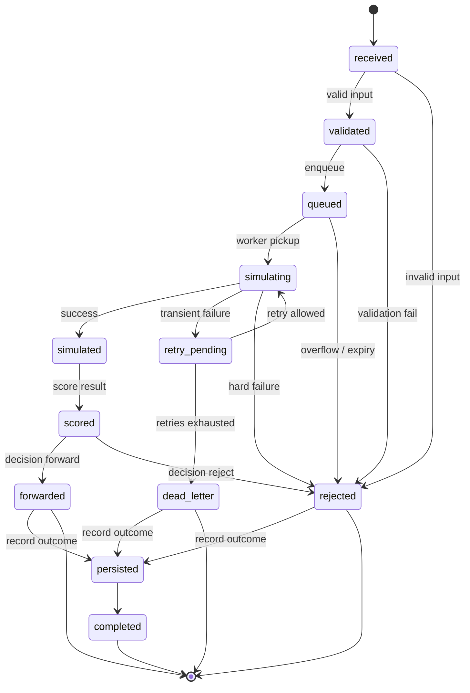
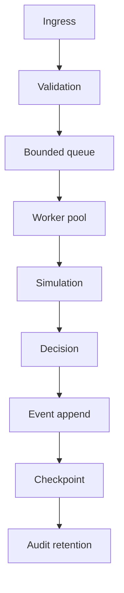
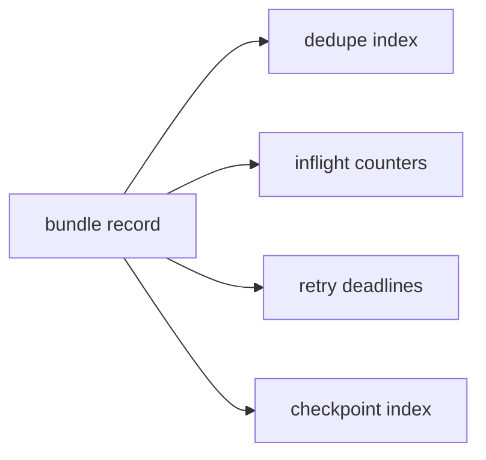
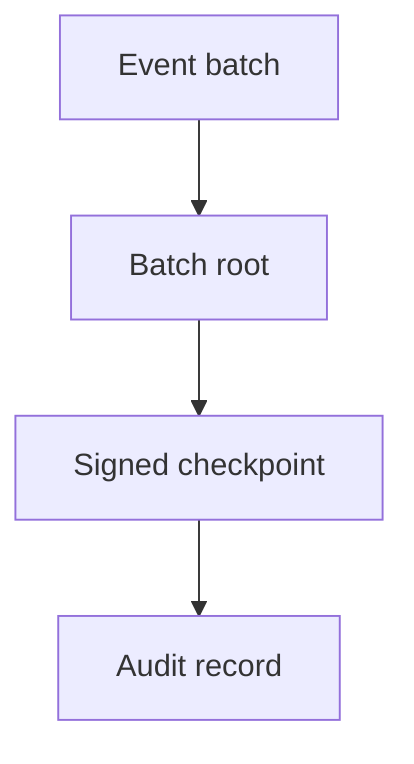

# MEV Relay v2

Bounded relay. External state. Early stale-work rejection.

## Scope

### In scope
- deadline-aware admission control
- value-aware scheduling
- stale-work shedding
- append-only events
- Merkle batch commitments
- signed checkpoints
- brokered work distribution
- Valkey-backed coordination state
- bounded history windows and retention
- replay-safe dedupe and retry deadlines
- OTEL traces, metrics, and logs
- recovery after partial failure

### Out of scope
- rewriting the v1 lifecycle
- global routing
- cross-region consensus
- hot-path proof systems
- unbounded history reads
- FIFO fairness as the primary policy

## Problem framing

Bundle admission uses a lower-bound estimate.

- inputs: value, cost, service time, deadline slack, resource demand
- admit: positive net value and sufficient slack
- reject: stale or low-value work
- objective: maximize expected value under bounded CPU, memory, broker, Valkey, WAL, RPC, and slot time

## NFRs

| NFR | Meaning | Default / bound |
|---|---|---|
| Boundedness | no unbounded queues, retries, or history scans | queue 1024, retries 3, history 256 |
| Safety | invalid work dies early; failure is explicit | fail closed on ingress, queue, state, broker, WAL |
| Health | the process reports degraded before unsafe | degraded at 80% queue, unsafe at full queue |
| Recoverability | restart must rebuild a consistent state | Valkey state + WAL replay + version fencing |
| Resource consciousness | hot state stays out of heap; reads are capped | Valkey TTL + capped reads + WAL compaction |
| Auditability | every terminal decision leaves evidence | events, checkpoints, OTEL, retention |
| Throughput | transport and coordination are separate concerns | NATS for transport, Valkey for state |
| Simplicity | the hot path stays small | fixed workers, bounded queue, limited retries |

## Operating envelope

### Defaults
- `QUEUE_DEPTH=1024`
- `WORKER_COUNT=4`
- `MAX_RETRIES=3`
- `RETRY_BACKOFF=500ms`
- `REQUEST_TIMEOUT=2s`
- `MAX_PAYLOAD_BYTES=256KiB`
- `MAX_INFLIGHT_PER_CLIENT=20`
- `HISTORY_LIMIT=256`
- `STATE_RETENTION=24h`
- `WAL_MAX_ENTRIES=2048`
- `COST_PER_TX=0.25`
- `BACKEND_KIND=anvil`
- `BACKEND_URL=http://127.0.0.1:8545`

### Derived limits
- retry window is bounded by retry count and backoff
- per-instance throughput is bounded by `min(Cin, Csim, Cdb, Cout)`
- history visibility is bounded by `HISTORY_LIMIT`
- live state age is bounded by `STATE_RETENTION`
- WAL growth is bounded by `WAL_MAX_ENTRIES`

### Production constraint model
- one instance is not the 100k/s answer
- 100k/s needs horizontal partitioning or upstream load distribution
- Valkey, NATS, and the worker pool are separate bottlenecks
- one saturated bottleneck makes readiness degraded or unsafe

## Quantitative model

See [`docs/lifecycle-math.md`](./docs/lifecycle-math.md) for the lower-bound model.

Short version:
- `value = VALUE_PER_TX * (1 + ln(1 + txs)) * freshness`
- `cost = service_ms * COST_PER_MS + txs * COST_PER_TX`
- `accept` only when value stays above cost and the deadline still has slack
- worst-case retry path is about `9.25s` before dead-letter at current defaults, before queue and persistence overhead
- timeout-bound throughput floor is about `2 bundles/s` per instance
- a full queue drains in about `512s` at that floor
- state transitions reuse returned records instead of rereading after each hop
- event and checkpoint bodies are encoded once per write path
- WAL compaction stays off the common path until the log is well past the bound

## Infra

The local Compose stack includes:
- Valkey for hot coordination state
- NATS for transport
- Anvil as the default Ethereum backend
- the relay service
- an OTEL collector
- a persistent volume for WAL and checkpoint data

The relay also exposes:
- `/healthz`
- `/readyz`
- `/metrics`

Operational docs: [`docs/README.md`](./docs/README.md).
Local compose includes Prometheus and Alertmanager for alert checks.
Set `API_AUTH_TOKEN` to require a bearer token on submit.
Compose is the default local runtime.

### Backend adapters
The relay core talks to a backend adapter, not a concrete network.

Supported modes:
- `local`: deterministic in-process simulation
- `anvil`: default local Ethereum JSON-RPC backend
- `sepolia`: live public testnet RPC

Anvil is the default. Sepolia is opt-in through `BACKEND_KIND=sepolia`.

## Model

v2 graphs:

- `G_life`: bundle lifecycle
- `G_event`: append-only event graph
- `G_commit`: batch commitment graph
- `G_region`: region / trust boundaries
- `G_fail`: failure graph
- `G_cap`: capacity graph

`M2 = (G_life, G_event, G_commit, G_region, G_fail, G_cap, I, Gg)`

### Lifecycle graph

### Data flow

### Coordination state

Hot coordination state lives in Valkey:
- dedupe keys
- inflight counters
- retry deadlines
- checkpoint index
- bundle records

Reads are capped by `HISTORY_LIMIT`. Live keys expire under `STATE_RETENTION`.

### Commitment graph

### Region graph

## DSA

### Commitments
- Merkle trees for batch commitments
- signed checkpoints for batch verification

### Replay
- append-only logs / WALs for replay
- Valkey for live coordination state
- snapshot state for recovery
- bounded WAL reads
- bounded WAL size

### Identity and dedupe
- hash maps for dedupe and idempotency
- exact membership checks keyed by bundle hash or idempotency key

### Retry scheduling
- priority queues for retry deadlines
- bounded retry windows and retry counts
- retry state stored externally

### Dispatch
- bounded queues / ring buffers for work dispatch
- fixed worker pools for bounded concurrency

## Operations

- `/healthz` tells you if the node is healthy, degraded, or unsafe
- `/readyz` fails closed when the node should not accept work
- `/metrics` is the scrape target for alerts and dashboards
- Prometheus and Alertmanager are wired in `infra/compose.yaml`
- in-memory only for transient execution

### Graph safety
- topological sort for batch/event ordering
- reachability checks for valid recovery paths
- strongly connected component checks for retry loops
- flow / min-cut helpers for capacity analysis

### Bounded access
- `ListBundles`, `ListEvents`, and `ListCheckpoints` take explicit limits
- `WAL.ReadAll` takes an explicit limit
- Valkey keys expire on a retention window
- checkpoint and event history are pruned after sealing
- WAL compaction keeps the local audit file bounded

## Constraint model

### Lifecycle constraints
- `queue_depth <= QUEUE_DEPTH`
- `retry_count <= MAX_RETRIES`
- `simulation_time <= REQUEST_TIMEOUT`
- `payload_size <= MAX_PAYLOAD_BYTES`
- `client_inflight <= MAX_INFLIGHT_PER_CLIENT`
- `history_reads <= HISTORY_LIMIT`
- `live_state_age <= STATE_RETENTION`
- `wal_entries <= WAL_MAX_ENTRIES`

### Production constraints
- ingress must reject malformed or oversized requests early
- queue overflow must shed load
- retry budget exhaustion must dead-letter
- state operations must fail closed if Valkey is unhealthy
- broker publish must fail closed if NATS is unhealthy
- WAL write or compaction failure must surface as unsafe

## Live risks

### Safety
- invalid requests can still arrive at the edge
- client identity is transport-derived, not authenticated
- duplicate bundles can be replayed with changed arrival timing

### Edge
- queue pressure can evict valid work
- retry storms can starve new work
- broker backpressure can stall event emission
- Valkey latency can become the coordination bottleneck

### Health
- `/healthz` reports state, broker, WAL, and queue pressure
- `/healthz` also exposes queue age, queue value, and retry debt
- `/readyz` fails closed on unsafe state
- degraded means pressure is high but still routable
- unsafe means the instance should not receive new work

### Resource risk
- `Valkey` holds dedupe, inflight, retries, and checkpoints
- `NATS` holds transport pressure
- `WAL` holds audit pressure
- `queue` holds work pressure
- queue age and retry debt are first-class health signals
- each of these can become the bottleneck under hostile load

## Risk and audit controls

| Risk | Operational consequence | Audit artifact | Control |
|---|---|---|---|
| stale bundle accepted | value lost to expiry | ingress timestamp, queue age, decision log | deadline-aware admission and age-based shedding |
| retry storm | queue and Valkey pressure | retry count, retry deadline, dead-letter record | bounded retries and external retry schedule |
| broker slowdown | event lag and missing publish windows | broker health, publish latency, checkpoint lag | fail closed on broker unhealthy, keep publish bounded |
| Valkey saturation | coordination stalls | state health, inflight counters, retry claim lag | TTL bounds, capped reads, fixed hot-key scope |
| WAL corruption or growth | recovery and audit gap | WAL health, compaction result, checkpoint record | bounded WAL entries, flush cadence, fail unsafe on write error |
| duplicate admission | wasted work or double spend risk | dedupe hash, bundle ID, transition log | exact dedupe index and idempotent state transitions |
| low-value queue growth | capital tied up in stale work | queue value, queue age, retry debt | value-aware admission and priority scheduling |

The audit rule is simple:
- every accepted bundle must leave a durable trail
- every rejection must say why
- every terminal decision must be reconstructable from state, events, and checkpoint
- every unsafe condition must be observable before it becomes silent loss

## Control points

### Ingress
- validate schema
- validate payload size
- enforce client inflight cap
- reject malformed input

### Queue admission
- enforce `QUEUE_DEPTH`
- shed on overflow
- do not buffer outside the queue

### Worker execution
- enforce `REQUEST_TIMEOUT`
- classify retryable versus terminal failure
- keep concurrency fixed

### Persistence
- enforce bounded state retention
- renew TTL on hot keys
- keep terminal records aligned with durable state

### Retry path
- enforce `MAX_RETRIES`
- store retry deadlines externally
- dead-letter on budget exhaustion

## Telemetry

OTEL is mandatory.

### Trace attributes
- trace ID
- bundle ID
- client ID
- region ID
- state transition
- retry count
- outcome

### Metrics
- request rate
- queue depth
- queue age
- queue net value
- retry debt
- worker saturation
- simulation latency
- state latency
- broker latency
- retry rate
- dead-letter rate
- decision rate

### Why
These metrics are the control surface for the knapsack policy.

- request rate shows incoming pressure
- queue depth and queue age show whether fresh work is still getting through
- queue net value shows whether the backlog is economically worth keeping
- retry debt shows how much capacity is being burned on rework
- worker saturation shows whether compute is the active bottleneck
- simulation, state, and broker latency show where the hot path is losing time
- retry, dead-letter, and decision rates show whether the policy is shedding, converging, or churning

### Logs
- structured
- redacted
- correlated by IDs
- no raw bundle payloads by default

## Audit readiness

- every accepted bundle has a durable identity
- every state transition is recorded
- every terminal decision is explainable
- every batch commitment is verifiable
- every retry is bounded and visible
- every rejection is classified
- every operational failure is observable
- every history surface is capped
- every risk surface has a bounded control and an audit trail

## Broker choice

Choose the broker from measured throughput and audit needs.

| Broker | p50 dispatch latency | Replay / retention | Ops burden | Multi-consumer fanout | Fit for v2 hot path | Fit for v2 audit path | Quantified tradeoff |
|---|---:|---:|---:|---:|---:|---:|---|
| NATS / JetStream | 9/10 | 6/10 | 8/10 | 7/10 | 10/10 | 7/10 | Best if the relay needs fast bounded transport and acceptable durable retention without platform drag. |
| Kafka | 6/10 | 10/10 | 5/10 | 10/10 | 6/10 | 10/10 | Best if replay, retention, and consumer fanout dominate and the team can pay the coordination cost. |
| Pulsar | 7/10 | 9/10 | 4/10 | 9/10 | 7/10 | 9/10 | Best if multi-tenancy and tiered storage matter enough to justify a heavier control plane. |
| Managed pub/sub | 8/10 | 5/10 | 9/10 | 6/10 | 8/10 | 5/10 | Best if operator burden is the primary constraint and weaker retention is acceptable. |

### Recommendation
- **Hot path:** NATS / JetStream
- **Audit / replay heavy deployments:** Kafka
- **Multi-tenant platform deployments:** Pulsar
- **Lowest-ops environments:** managed pub/sub

For v2 specifically, the default is NATS / JetStream because the relay needs low-latency bounded transport first, with Valkey and WAL carrying the coordination and audit state.

## Success criteria

- v1 lifecycle behavior remains intact
- Valkey holds the authoritative coordination state
- the WAL stays bounded
- reads are capped everywhere
- health reports degraded before unsafe
- retries are bounded and externalized
- checkpoints are signed and retained
- graph algorithms are available for analysis, not on the hot path
- `go test ./...` passes in v2

## Non-goals

- unbounded replay
- unbounded retention
- global routing
- cross-region consensus
- hot-path graph recomputation
- exactly-once broker semantics
