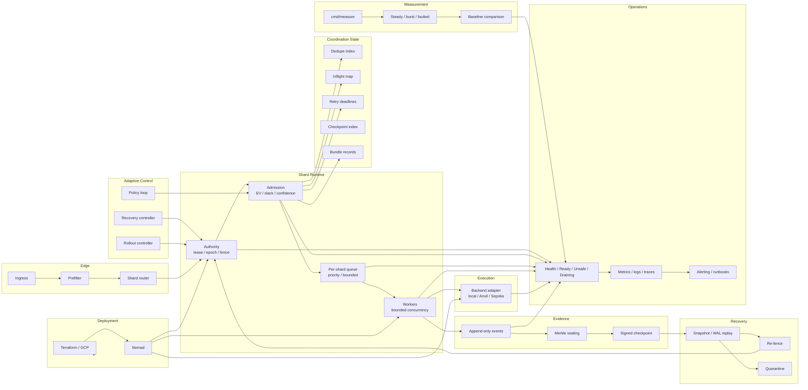

# v3 Architecture

v3 is shard-local. The path is:

```text
ingress -> prefilter -> router -> authority -> admission -> queue -> worker -> backend -> evidence -> recovery -> ops
```

The public contract stays the same. Authority, queueing, evidence, and recovery are shard-owned.

## Current flow

- ingress rejects malformed or oversized requests.
- prefilter handles duplicate and freshness checks.
- router uses rendezvous hashing over canonical bundle ID, network ID, and target slot.
- authority is lease, epoch, and fence token.
- admission gates on value, slack, and confidence.
- queueing is bounded per shard.
- workers run with bounded concurrency per shard.
- backend access goes through local, Anvil, or Sepolia adapters.
- evidence is append-only events, Merkle sealing, and signed checkpoints.
- checkpoint artifacts are written to MinIO; checkpoint metadata and authority state stay in Valkey.
- recovery uses snapshot, WAL, checkpoint replay, then re-fencing.
- operations cover health, metrics, traces, alerts, and runbooks.
- the relay also runs a bounded policy loop that tightens or relaxes admission, queue age, and retry timing from measured pressure and confidence.
- recovery and rollout each have their own controller state, not just flags.
- the measurement runner replays steady, burst, and faulted scenarios against the same runtime stack.

## Ownership and data

| Object | Owned by | Purpose |
|---|---|---|
| bundle record | shard | current bundle state |
| dedupe entry | shard | idempotency |
| inflight entry | shard | bounded concurrency |
| retry deadline | shard | bounded retry scheduling |
| event log entry | shard | durable transition history |
| checkpoint | shard | sealed terminal state |
| lease / epoch / fence | shard | authority and stale-write rejection |

## Invariants

- one owner per shard at a time
- stale writers fail on every write path
- retries remain bounded
- one terminal path per bundle
- recovery does not rejoin before re-fencing
- health fails closed when authority or dependency state is unsafe
- state transitions reuse returned records instead of rereading after each hop
- event and checkpoint payloads are encoded once for WAL writes
- WAL compaction stays off the common path until the log is well past the bound

## Graph roles

| Graph | Role |
|---|---|
| authority graph | lease, epoch, fence, stale-writer rejection |
| routing graph | deterministic shard assignment |
| lifecycle graph | allowed state transitions |
| retry graph | bounded retry attempts |
| recovery graph | snapshot, WAL, checkpoint, re-fence, rejoin |
| rollout graph | drain, cutover, rollback |
| capacity graph | queue, worker, backend, state-store bottlenecks |
| dependency graph | health and quarantine decisions |

## Implementation map

| Package | Owns |
|---|---|
| `internal/config` | runtime limits and wiring values |
| `internal/model` | bundle, record, checkpoint, and result types |
| `internal/lifecycle` | allowed states and transition checks |
| `internal/graph` | routing, authority, recovery, and offline graph checks |
| `internal/scheduler` | bounded per-shard queues |
| `internal/state` | shard records, dedupe, inflight, retries, events, checkpoints, authority |
| `internal/backend` | simulation adapters |
| `internal/broker` | event publish transport |
| `internal/checkpoint` | checkpoint artifact storage |
| `internal/commitment` | Merkle root and checkpoint sealing |
| `internal/telemetry` | metrics and exported counters |
| `internal/measurement` | scenario runs, baselines, and proof-loop outputs |
| `internal/relay` | request path, admission, worker loop, health, recovery/rollout control, policy loop |
| `cmd/relay` | process startup |
| `cmd/measure` | scenario runner and regression report generation |

## Runtime rule

- hot-path checks stay in `internal/relay`, `internal/lifecycle`, `internal/scheduler`, and `internal/state`
- offline analysis stays in `internal/graph`
- durable writes stay in `internal/state`, `internal/commitment`, and `internal/broker`
- checkpoint artifacts stay in `internal/checkpoint`
- proof-loop wiring stays in `internal/measurement` and `cmd/measure`
- process wiring stays in `cmd/relay`

## Live structures

- routing table
- lease / epoch / fence records
- exact dedupe map
- per-shard priority queue
- inflight map
- retry deadlines
- append-only event log
- checkpoint index

## Offline structures

- SCC and reachability
- min-cut / flow
- replay graph checks

## Diagram


