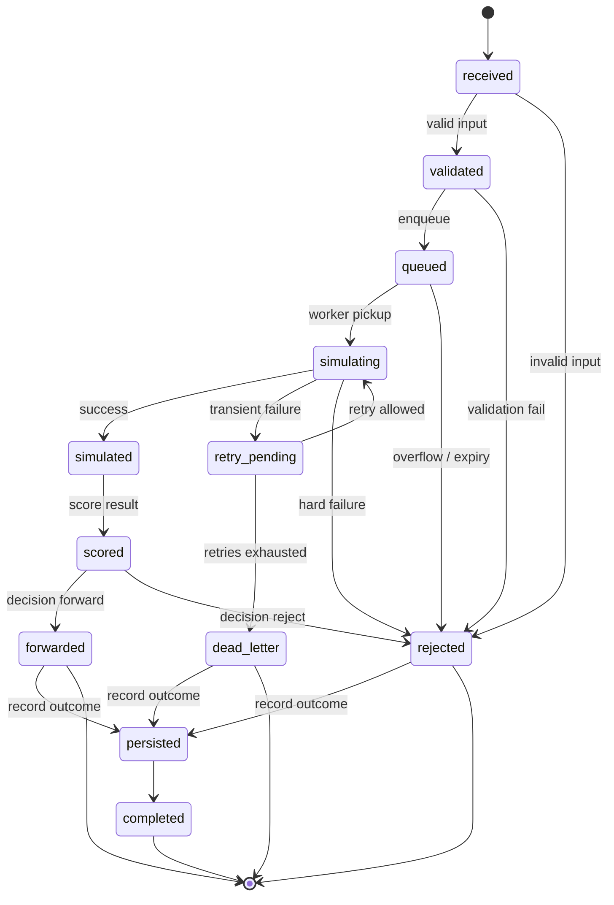
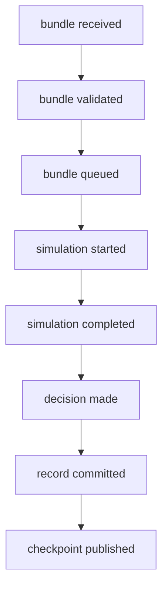
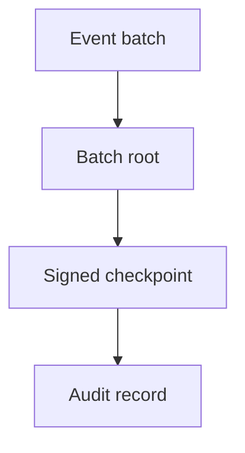
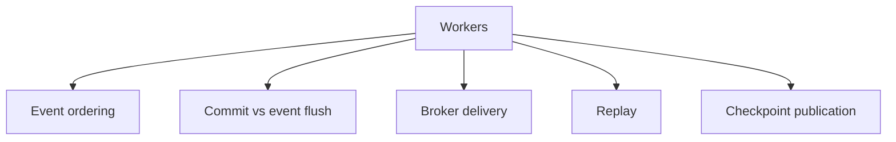

# MEV Relay v2

v2 adds auditability, replayability, and throughput controls.

It keeps the v1 lifecycle. It adds event commitments, brokered work, OTEL, and audit evidence.

## Scope

### In scope

- append-only events
- batch commitments
- signed checkpoints
- replay-safe dedupe
- region-aware IDs
- brokered work distribution
- OTEL traces, metrics, logs
- audit retention
- recovery after partial failure

### Out of scope

- rewriting the v1 lifecycle
- removing bounded queues or retries
- global routing
- cross-region consensus
- hot-path proof systems

## Goals

- increase throughput
- preserve traceability
- make history tamper-evident
- support replay and recovery
- provide audit evidence

## Model

v2 extends the v1 graphs.

- `G_life` bundle lifecycle
- `G_event` append-only event graph
- `G_commit` batch commitment graph
- `G_region` region and trust boundaries
- `G_fail` failure graph
- `G_cap` capacity graph

`M2 = (G_life, G_event, G_commit, G_region, G_fail, G_cap, I, Gg)`

### Lifecycle graph

Same states as v1, with event emission on every transition.

### Event graph

Each state change emits an event.

### Commitment graph

Events are committed in batches.

Use Merkle trees here if batch proofs are required.

### Region graph

## Quantified controls

Values are deployment-specific. The control points are fixed.

- `Qmax` queue depth
- `Rmax` retry count
- `Tretry_max` retry window
- `Tsim_max` simulation timeout
- `Tdb_max` DB write timeout
- `Csim` simulator concurrency
- `Cdb` DB write concurrency
- `Cin` intake rate
- `Cout` decision rate
- `Pmax` payload size
- `Imax` in-flight per client

## Constraints

- `queue_depth <= Qmax`
- `retry_count <= Rmax`
- `retry_time <= Tretry_max`
- `simulation_time <= Tsim_max`
- `db_write_time <= Tdb_max`
- `throughput <= min(Cin, Csim, Cdb, Cout)`
- `payload_size <= Pmax`
- `client_inflight <= Imax`

## Control points

### Ingress

- validate schema
- validate signature
- enforce `Pmax`
- enforce `Imax`
- reject malformed input

### Queue admission

- enforce `Qmax`
- shed on overflow
- never buffer indefinitely outside the queue

### Worker execution

- enforce `Tsim_max`
- classify retryable vs terminal failure
- bound worker concurrency with `Csim`

### Persistence

- enforce `Tdb_max`
- persist transitions and terminal records
- keep durable state aligned with terminal state

### Retry path

- enforce `Rmax`
- enforce `Tretry_max`
- dead-letter on budget exhaustion

## Data structures

- bundle record
- transition record
- event record
- batch commitment record
- checkpoint record
- dedupe index
- retry schedule entry
- broker topic or stream

## Algorithms

### Admission

1. parse
2. validate
3. derive bundle ID
4. dedupe
5. enqueue or reject

### Transition

1. load current state
2. check edge guard
3. apply transition
4. emit event
5. emit checkpoint candidate at batch boundary

### Retry

1. classify failure
2. increment retry count
3. check retry budget
4. re-enqueue or dead-letter

### Commitment

1. batch events
2. compute batch root
3. sign checkpoint
4. persist commitment record

## Broker choice

Choose the broker from measured throughput and audit needs.

### NATS / JetStream

- low-latency dispatch
- simple operations
- moderate durability

### Kafka

- durable event history
- replay
- multiple consumers
- audit-friendly retention

### Pulsar

- multi-tenancy
- tiered storage
- heavier platform

### Managed pub/sub

- lower ops burden
- less control

## Telemetry

OTEL is mandatory in v2.

### Trace attributes

- trace ID
- bundle ID
- client ID
- region ID
- state transition
- retry count
- outcome

### Metrics

- request rate
- queue depth
- worker saturation
- simulation latency
- DB latency
- retry rate
- dead-letter rate
- decision rate

### Logs

- structured
- redacted
- correlated by IDs
- no raw bundle payloads by default

## Audit readiness

### Control objectives

- every accepted bundle has a durable identity
- every state transition is recorded
- every terminal decision is explainable
- every batch commitment is verifiable
- every retry is bounded and visible
- every rejection is classified
- every operational failure is observable

### Governance

- service ownership is explicit
- config changes are controlled
- deployment changes are tracked
- runtime roles are scoped
- production access is logged

### Evidence

- OTEL traces
- structured logs
- retained event records
- signed checkpoints
- load test output
- failure drill output
- recovery drill output
- incident records

### Access control

- service identities are distinct
- operator access is least privilege
- signing keys are scoped and rotated
- privileged actions are logged

### Retention

- event history is append-only
- checkpoint history is retained
- audit records follow policy
- raw payload retention is minimized

### Recovery

- restart behavior is testable
- partial failure is reconciled
- terminal records are stable
- replay produces a consistent trail

## Race Model

| Race | Risk | Mitigation | Decision cost | Alternative |
|---|---|---|---|---|
| Event ordering | Out-of-order audit history | Per-bundle sequence numbers, append-only writer | More serialization per key | Single writer per partition key |
| Commit vs flush | Checkpoint before durable events | Batch barrier, commit after flush | Higher commit latency | Async checkpoint with reconciliation pass |
| Broker delivery | Duplicate or delayed messages | Idempotent consumers, dedupe index, monotonic sequence | Consumer complexity | No broker; direct writes only |
| Replay race | Original and replayed event both process | Versioned state write, compare-and-set | More state checks | Strict single-threaded recovery |
| Checkpoint publication | Late events after batch seal | Explicit batch boundary, sealed batch state | Less flexible batching | Continuous log with no checkpointing |

### v2 rule

- event sequence is monotonic
- batch is sealed before checkpoint
- consumers are idempotent
- replay is fenced by version
- broker messages are not trusted for exactly-once semantics

## Decision Cost

### Keep

- append-only events
- batch commitments
- signed checkpoints
- brokered work

### Cost

- ordering discipline per key
- idempotent consumers
- batch sealing and flush barriers
- audit-aware replay logic

### Alternative

- direct synchronous writes
- no broker
- no batch commitments
- weaker replay guarantees

## Failure model

### Failure classes

- replay
- queue saturation
- backend timeout
- DB stall
- checkpoint write failure
- broker outage
- region isolation failure
- log leakage

### Failure behavior

- reject fast on malformed input
- shed load on saturation
- retry only within budget
- dead-letter on budget exhaustion
- fail closed when integrity is uncertain

## Not a goal

- removing bounded lifecycle control
- making the runtime global
- relying on Merkle trees for hot-path correctness
- turning throughput work into a platform rewrite

## Exit criteria

- every bundle state change is recorded as an event
- event batches can be committed and verified
- duplicates are deterministic
- OTEL traces show end-to-end flow
- broker choice is justified by measurement
- recovery after partial failure is testable
- audit evidence supports external review
