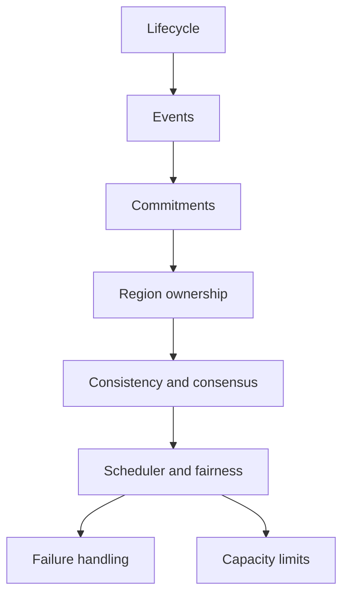

# MEV Relay v3

v3 is the distributed blockchain-rigour pass.

It assumes mainnet-grade operation, multi-region deployment, and hostile conditions across the full stack.

## Scope

### In scope

- distributed ownership rules
- consistency semantics
- partition behavior
- rollout and migration rules
- multi-region state handling
- scheduler fairness
- storage corruption recovery
- latency percentile targets
- economic and game-theoretic attack handling

### Out of scope

- changing the v2 audit model
- dropping bounded failure behavior
- ignoring mainnet latency pressure

## Graph model

v3 extends v2.

- `G_life` bundle lifecycle
- `G_event` append-only event graph
- `G_commit` commitment graph
- `G_region` region ownership graph
- `G_consistency` consistency and consensus graph
- `G_sched` scheduling and fairness graph
- `G_fail` failure graph
- `G_cap` capacity graph

`M3 = (G_life, G_event, G_commit, G_region, G_consistency, G_sched, G_fail, G_cap, I, Gg)`

## Races

### Cross-region races

- split-brain ownership
- double commit
- stale read after failover
- replay during recovery
- rollout overlap between versions

| Race | Risk | Mitigation | Decision cost | Alternative |
|---|---|---|---|---|
| Split-brain ownership | Two regions act on the same bundle | Leases, fencing tokens, quorum ownership | More coordination and failover logic | Active-passive only |
| Double commit | Two terminal truths | Single commit authority, quorum check, version fence | Higher commit latency | Strict single-region authority |
| Stale read | Wrong decision from outdated state | Versioned reads, read-your-writes where needed | More read coordination | Relaxed consistency with delayed decisions |
| Replay during recovery | Old state reappears as current | Epoch numbers, recovery fencing | More recovery metadata | Manual recovery only |
| Rollout overlap | Old and new code both process flow | Migration windows, compatibility gates, cutover fence | Slower deploys | Big-bang cutover |

### Scheduler races

- starvation
- priority inversion
- unfair tenant capture
- deadline collapse

| Race | Risk | Mitigation | Decision cost | Alternative |
|---|---|---|---|---|
| Starvation | Valid work never runs | Fair queue discipline, aging | Lower peak priority performance | Strict priority only |
| Priority inversion | Low-priority work blocks high-value work | Priority inheritance / bounded queue classes | More scheduler logic | Single FIFO queue |
| Tenant capture | One client dominates capacity | Per-tenant quotas, weighted fairness | Lower utilization under burst | Best-effort only |
| Deadline collapse | Missed mainnet windows | Deadline-aware scheduling, preemption | More scheduling overhead | No deadline guarantees |

## Consistency semantics

- define which writes are linearizable
- define which reads may be stale
- define what is authoritative after failover
- define what can be recomputed from evidence

## Recovery under partial corruption

- detect torn writes
- reject partial checkpoints
- rebuild from last valid commitment
- fence stale replicas

## Economics

- cost per bundle under contention
- cost of failover
- cost of replay
- cost of fairness
- cost of proof and checkpointing

## Alternatives

- stronger consensus
- simpler active-passive ownership
- strict single-region control
- relaxed consistency with delayed settlement

## Exit criteria

- ownership is unambiguous
- consistency rules are explicit
- partitions have defined behavior
- rollout has a fence
- fairness is measurable
- corruption recovery is testable
- latency percentiles are defined
