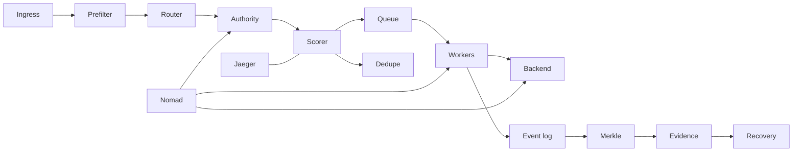

# MEV Relay v3

v3 is the mainnet-grade distributed control plane for the MEV relay. It preserves the public ETH MEV relay contract and moves authority, state, and recovery into a shard-local model.

## Purpose

- stay compatible with the wider ETH MEV relay surface
- reject unsafe or stale work cheaply
- preserve value under deadline pressure
- avoid split-brain authority
- recover deterministically
- keep audit evidence coherent

## Design defaults

- shard key = canonical bundle ID + network ID + target slot
- ownership = shard owns bundles; client/validator/region are metadata
- routing = rendezvous hashing over a fixed shard set
- authority = lease, epoch, fence token; lease TTL `5s`; renew every `1s`
- retry rule = max `3`, `500ms` backoff, only while EV > 0
- chain rule = conservative; fail closed on uncertainty
- recovery rule = snapshot + WAL + checkpoint replay, then re-fence
- observability rule = sampled Jaeger traces; bounded logs

## Deployment model

- GCP infrastructure via Terraform
- Nomad for orchestration and rollout
- 1 active region by default
- public HTTPS edge
- Jaeger for traces
- Cloud Storage for audit artifacts
- Valkey or Memorystore for hot coordination state
- baseline 24/7 cost: `$250-$300/month` self-hosted, `$350-$450/month` managed state, excluding engineering, egress, and incidents

## Operating envelope

Runtime defaults:
- `QUEUE_DEPTH=1024` per shard
- `WORKER_COUNT=4` per shard
- `MAX_RETRIES=3`
- `RETRY_BACKOFF=500ms`
- `LEASE_TTL=5s`
- `LEASE_RENEW_INTERVAL=1s`
- `REQUEST_TIMEOUT=2s`
- `MAX_PAYLOAD_BYTES=256KiB`
- `MAX_INFLIGHT_PER_CLIENT=20`
- `HISTORY_LIMIT=256`
- `STATE_RETENTION=24h`
- `WAL_MAX_ENTRIES=2048`

Hard rules:
- queue age target under `1s`
- queue age at `1 slot` (`12s`) is unsafe
- queue full is unsafe
- stale authority is unsafe
- low chain confidence is unsafe
- retries stop when expected value is non-positive
- recovery must re-fence before rejoin

Capacity:
- a single instance is not the 100k/s answer
- 100k/s requires partitioning or upstream load distribution
- shard-local state, queueing, and authority are the first scaling boundary
- Valkey / Memorystore, NATS, and the worker pool are bottlenecks

## Operational states

| State | Meaning |
|---|---|
| Ready | authority current, queue age under target, confidence above threshold |
| Degraded | pressure rising but still bounded |
| Unsafe | authority stale, queue full, confidence below threshold, or recovery inconsistent |
| Draining | shutdown or handoff; finish in-flight work, seal state, release authority |

## Public surfaces

| Endpoint | Purpose |
|---|---|
| `/relay/v1/data/validator_registration` | validator registration lookup |
| `/relay/v1/builder/validators` | builder-facing validator set |
| `/relay/v1/builder/blocks` | builder block submission |
| `/healthz` / `/readyz` | operational health and routing |

## Architecture

## NFRs

| NFR | Target |
|---|---|
| Correctness | one owner per shard or bundle; no double terminalization |
| Safety | fail closed on uncertainty |
| Boundedness | queue, retries, retention, and scans are capped |
| Latency | cheap reject path; no global coordination on hot path |
| Throughput | shard-local workers; bounded backpressure |
| Recoverability | deterministic replay with fencing and version checks |
| Auditability | every accepted decision leaves reconstructable evidence |
| Observability | traces, metrics, logs show authority, pressure, provenance |
| Scalability | scale by sharding, not by adding global coordination |
| Operability | clear health states, clear status codes, clear failover rules |

## DSA

Live:
- rendezvous hashing for shard routing
- lease / epoch / fence records for authority
- exact dedupe map for idempotency
- per-shard priority queue for admission and retries
- inflight map for bounded concurrency
- append-only event log for durable evidence
- Merkle trees for checkpoint sealing

Offline:
- SCC and reachability for recovery and dependency validation
- min-cut / flow for capacity analysis
- replay graph checks for recovery safety

## Risk model

| Risk | Control |
|---|---|
| split-brain ownership | leases, epochs, fencing tokens |
| retry storm | max `3` retries, `500ms` backoff, EV gate |
| broker lag | idempotent consumers; broker as transport only |
| checkpoint corruption | Merkle sealing; valid checkpoint only |
| audit divergence | append-only events; bounded flush |
| queue pressure | deadline-aware admission and shedding |
| rollout overlap | version fences and cutover windows |
| observability overload | sampling, bounded cardinality |

## Status codes

| Condition | Status |
|---|---|
| accepted into bounded pipeline | `202 Accepted` |
| malformed request | `400 Bad Request` |
| unauthorized / forbidden | `401 Unauthorized` / `403 Forbidden` |
| duplicate or ownership conflict | `409 Conflict` |
| stale precondition / stale epoch | `412 Precondition Failed` |
| payload too large | `413 Payload Too Large` |
| economically invalid | `422 Unprocessable Entity` |
| rate / inflight / budget exceeded | `429 Too Many Requests` |
| unsafe state or unhealthy dependency | `503 Service Unavailable` |
| upstream timeout | `504 Gateway Timeout` |
| internal invariant failure | `500 Internal Server Error` |

## Observability

- Jaeger traces carry request ID, bundle ID, shard ID, region ID, lease ID, epoch, fence token, chain-view ID, finality depth, confidence score, recovery state, and decision outcome
- metrics include request rate, queue depth, queue age, queue net value, retry debt, worker saturation, backend latency, state latency, broker latency, decision rate, and dead-letter rate
- sample slow paths and failures; keep labels bounded; do not log raw payloads by default

## Economics

v3 is a capitalized infrastructure asset with recurring operating cost. It is economically negative by default until value preservation or revenue is proven.

- compute: about `$245/month`; managed hot state: about `+$110/month`
- storage: low tens/month; logging / trace: `0` while under free tiers; egress is variable
- `ExpectedNet = ExpectedValue - DelayCost - ComputeCost - RetryCost - FailureRisk`
- admission requires `ExpectedNet > 0` under current authority and chain confidence
- break-even: `~$250/month` lean baseline, `~$350/month` managed hot state
- `10,000` accepted bundles/month: about `$0.025-$0.035` per bundle
- `100,000` accepted bundles/month: about `$0.0025-$0.0035` per bundle
- live threshold: `ValuePreserved + Revenue >= OperatingCost + CapitalCost + FailureLosses`

## Launch gate

Do not promote v3 unless:
- public relay APIs are compatible with mev-boost expectations
- one shard has one authority at a time
- stale writers are rejected on every write path
- recovery re-fences before rejoin
- queue age stays under target in stress tests
- retry debt stays bounded under burst
- chain confidence fails closed when stale or inconsistent
- audit trails reconstruct the same terminal truth
- observability stays sampled under load
- infra cost stays inside the operating envelope
- rollouts can cut over without mixed authority

## Non-goals

- Envoy by default
- gRPC everywhere
- microservice sprawl
- global hot-path coordination
- unbounded replay
- active-active multi-region before authority is proven
- optimistic action on uncertain chain state
