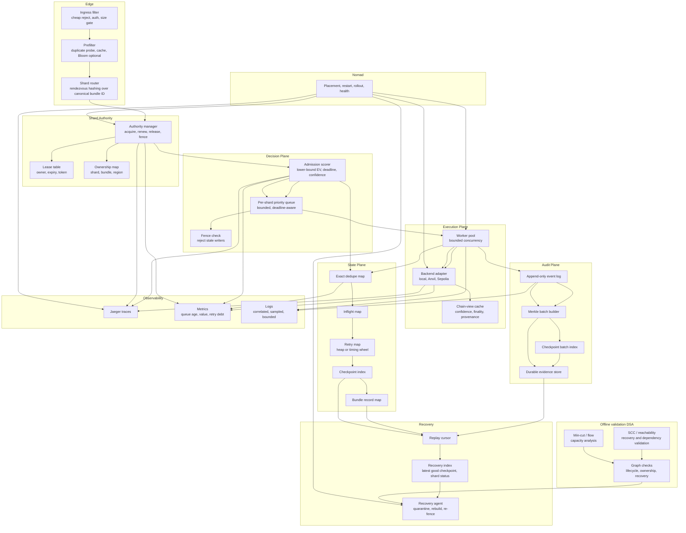

# MEV Relay v3

v3 is the mainnet-grade distributed control plane for the MEV relay. It is a public ETH MEV relay with shard-local authority, conservative admission, and deterministic recovery.

## Purpose

v3 ensures the relay:
- stays compatible with the wider ETH MEV relay surface
- rejects unsafe or stale work cheaply
- preserves value under deadline pressure
- avoids split-brain authority
- recovers deterministically
- keeps audit evidence coherent

## Design Decisions

These are the defaults v3 is built around.

| Question | Decision |
|---|---|
| What is the shard key? | canonical bundle ID + network ID + target slot |
| What owns work? | shard owns bundles; client, validator, region are metadata |
| How is routing done? | rendezvous hashing over a fixed shard set |
| How does authority work? | lease, epoch, fence token |
| How long is a lease valid? | `5s` |
| How often is it renewed? | every `1s` on the active owner |
| What breaks authority? | expiry, transfer, failed renewal, failed health check, or superseding epoch |
| What is the stale-writer rule? | reject every write that does not carry the current `(shard, epoch, fence token)` |
| What is the retry rule? | max `3` retries, `500ms` base backoff, only while EV remains positive |
| What is the chain rule? | conservative interpretation; fail closed on uncertainty |
| What is the recovery rule? | snapshot + WAL + checkpoint replay, then re-fence |
| What is the observability rule? | sampled Jaeger traces; bounded logs |
| What is the status rule? | `409` for conflict/duplicate/wrong shard, `412` for stale preconditions, `503` for unsafe state |

## v2 vs v3

| Dimension | v2 | v3 |
|---|---|---|
| Control model | bounded relay with value-aware admission | shard-authoritative distributed control plane |
| Authority | implicit single-process authority | explicit leases, epochs, and fences |
| State | Valkey-backed coordination state | shard-local authoritative state with failover discipline |
| Routing | local bounded queueing | deterministic shard routing |
| Recovery | bounded replay and audit coherence | fenced recovery and region-safe rejoin |
| Chain view | conservative estimator | conservative estimator plus confidence and provenance |
| Queue target | under `1s`, hard unsafe at `12s` | same target, with shard-local enforcement |
| Failure goal | bound loss | prevent conflicting truth under partition or rollout overlap |
| Infra cost | about `$250-$450/month` depending on state choice | similar baseline, plus multi-region only if proven necessary |

## Deployment model

Target deployment:
- GCP infrastructure provisioned by Terraform
- Nomad for orchestration and rollout
- 1 active region by default
- 3-zone control-plane quorum where applicable
- public HTTPS edge
- No Envoy by default
- Jaeger for traces
- Cloud Storage for audit artifacts
- Valkey or Memorystore for hot coordination state

Baseline 24/7 cost target:
- self-hosted hot state: about `$250-$300/month`
- managed hot state: about `$350-$450/month`
- excludes engineering, egress, and incident cost

## Operating Envelope

Runtime defaults and hard bounds.

### Runtime defaults
- `QUEUE_DEPTH=1024` per shard
- `WORKER_COUNT=4` per shard
- `MAX_RETRIES=3`
- `RETRY_BACKOFF=500ms`
- `LEASE_TTL=5s`
- `LEASE_RENEW_INTERVAL=1s`
- `REQUEST_TIMEOUT=2s`
- `MAX_PAYLOAD_BYTES=256KiB`
- `MAX_INFLIGHT_PER_CLIENT=20`
- `HISTORY_LIMIT=256`
- `STATE_RETENTION=24h`
- `WAL_MAX_ENTRIES=2048`

### Operating rules
- queue age target is under `1s`
- queue age at `1 slot` (`12s`) is hard unsafe
- queue full is unsafe
- stale authority is unsafe
- chain-confidence below threshold is unsafe
- retries stop when remaining expected value is non-positive
- expensive work stays off the hot path
- recovery must re-fence before rejoin

### Capacity interpretation
- a single instance is not the 100k/s answer
- 100k/s requires partitioning or upstream load distribution
- shard-local state, queueing, and authority are the first scaling boundary
- Valkey / Memorystore, NATS, and the worker pool are bottlenecks

## Operational States

v3 exposes four operator-visible states.

| State | Trigger | Operator meaning |
|---|---|---|
| Ready | authority current, queue age under target, confidence above threshold | safe to accept bounded new work |
| Degraded | pressure rising but still bounded | accept only if the shard can still clear value |
| Unsafe | authority stale, queue full, confidence below threshold, or recovery inconsistent | stop accepting new work |
| Draining | operator shutdown or handoff | finish in-flight work, seal state, release authority |

### Ready conditions
- authority lease is valid
- fence token matches current epoch
- queue age is under `1s`
- retry debt is within budget
- chain confidence is above threshold
- audit path is healthy
- recovery is idle or cleanly quarantined

### Unsafe conditions
- stale or missing authority
- queue full
- queue age at or beyond `1 slot` (`12s`)
- chain confidence below threshold
- checkpoint or replay inconsistency
- audit divergence
- retry amplification beyond cap

### Drain conditions
- scheduled rollout
- failover handoff
- operator shutdown
- region or shard migration

## Public surfaces

v3 must remain compatible with the standard ETH MEV relay shape:
- validator-facing relay endpoints
- builder-facing block submission endpoints
- validator registration lookup
- health and readiness
- metrics, logs, and traces

Core public endpoints:

| Endpoint | Purpose |
|---|---|
| `/relay/v1/data/validator_registration` | validator registration lookup |
| `/relay/v1/builder/validators` | builder-facing validator set |
| `/relay/v1/builder/blocks` | builder block submission |
| `/healthz` / `/readyz` | operational health and routing |

The internal design may be distributed; the public contract stays standard.

## Architecture

## Non-functional requirements

| NFR | Target |
|---|---|
| Correctness | one owner per shard or bundle; no double terminalization |
| Safety | fail closed on uncertainty; no optimistic stale-state actions |
| Boundedness | queue, retries, retention, and scans are capped |
| Latency | cheap reject path; no global coordination on hot path |
| Throughput | shard-local workers; bounded backpressure; async audit |
| Recoverability | deterministic replay with fencing and version checks |
| Availability | one shard or region may fail without corrupting others |
| Fault isolation | no global hot key, no global lock, no global queue |
| Auditability | every accepted decision leaves reconstructable evidence |
| Observability | traces, metrics, logs show authority, pressure, and provenance |
| Consistency | authority state is fenced; derived state may lag by design |
| Scalability | scale by sharding, not by adding global coordination |
| Fairness | starvation and priority inversion are bounded |
| Determinism | same evidence and epoch produce the same terminal truth |
| Operability | clear health states, clear status codes, clear failover rules |

## DSA

### Live DSA
- consistent or rendezvous hashing for shard routing
- lease / epoch / fence records for authority
- exact dedupe map for idempotency
- per-shard priority queue for admission and retries
- inflight map for bounded concurrency
- append-only event log for durable evidence
- Merkle trees for checkpoint sealing

### Offline DSA
- SCC and reachability for recovery and dependency validation
- min-cut / flow for capacity analysis
- replay graph checks for recovery safety

### What stays hot
- shard routing
- authority validation
- dedupe
- queue priority
- retry deadline lookup

### What stays offline
- SCC
- reachability over large graphs
- flow / cut analysis
- full replay scans

## Risk model

| Risk | Operational consequence | Control |
|---|---|---|
| split-brain ownership | two nodes act on the same truth | leases, epochs, fencing tokens |
| stale read | wrong admission or terminal decision | versioned reads, read-your-writes where needed |
| retry storm | backend burn and queue collapse | exact retry cap, economic retry gating |
| broker lag | delayed or duplicated event handling | idempotent consumers, broker as transport only |
| checkpoint corruption | recovery gap | Merkle sealing, valid checkpoint only, fail closed |
| audit divergence | evidence trail mismatch | append-only events, bounded flush, coherence checks |
| queue pressure | stale work displaces fresh work | deadline-aware admission and shedding |
| rollout overlap | old and new code disagree | version fences and cutover windows |
| chain-view uncertainty | wrong decision from partial truth | conservative interpretation and confidence gating |
| observability overload | telemetry becomes the outage | sampling, bounded cardinality, no raw payloads by default |
| stale authority | rejected writes or split-brain pressure | leases, renewals at `1s`, TTL `5s`, fenced writes |
| recovery overlap | replay outranks live authority | re-fence before rejoin; quarantine until validated |
| retry amplification | load and cost multiply on retries | retry cap `3`, `500ms` backoff, stop when EV goes non-positive |

## Status codes

| Condition | Status |
|---|---|
| accepted into bounded pipeline | `202 Accepted` |
| malformed request | `400 Bad Request` |
| unauthorized / forbidden | `401 Unauthorized` / `403 Forbidden` |
| duplicate, ownership conflict, or stale claim | `409 Conflict` |
| stale precondition, stale epoch, or stale chain-view contract | `412 Precondition Failed` |
| payload too large | `413 Payload Too Large` |
| structurally valid but economically invalid | `422 Unprocessable Entity` |
| rate / inflight / budget exceeded | `429 Too Many Requests` |
| unsafe state or unhealthy dependency | `503 Service Unavailable` |
| upstream timeout | `504 Gateway Timeout` |
| internal invariant failure | `500 Internal Server Error` |

## Observability

Jaeger traces must carry:
- request ID
- bundle ID
- shard ID
- region ID
- lease ID
- epoch
- fence token
- chain-view ID
- finality depth
- confidence score
- recovery state
- decision outcome

Metrics must include:
- request rate
- queue depth
- queue age
- queue net value
- retry debt
- worker saturation
- backend latency
- state latency
- broker latency
- decision rate
- dead-letter rate

Sampling rules:
- always sample slow paths and failures
- sample routine success paths
- keep labels bounded
- do not log raw payloads by default

## Economics

This is a capitalized infrastructure asset with recurring operating cost. It is economically negative by default until value preservation or revenue is proven.

### Live cost structure

| Cost item | Lean target | Notes |
|---|---:|---|
| Compute | about `$245/month` | 3 control-plane VMs, 2 workers, 1 state VM, 1 broker VM |
| Managed hot state | about `+$110/month` | if Memorystore replaces self-hosted state |
| Storage | low tens/month | audit artifacts and checkpoints |
| Logging / trace | `0` while under free tiers | becomes material if per-request telemetry is too verbose |
| Egress | variable | depends on builder and validator traffic |
| Engineering / on-call | not included | usually larger than infra once the system is live |

### Go-runtime cost

Hot-path cost is dominated by:
- allocations
- goroutine churn
- lock contention
- retries
- synchronous logging
- remote calls in the admission path

The economic rule is simple:
- cheaper reject path wins
- bounded queues win
- sampled telemetry wins
- retries only when remaining value is positive

The economic test is:

`Net = ValuePreserved + Revenue - OperatingCost - CapitalCost - FailureLosses`

If `Net > 0`, the system is value-positive.
If direct revenue is added later, it can become a profit center.

### Live economics

`ExpectedNet = ExpectedValue - DelayCost - ComputeCost - RetryCost - FailureRisk`

Admission requires `ExpectedNet > 0` under current authority and chain confidence.

Live rules:
- reject stale work early
- reject low-confidence work early
- keep retries finite
- sample observability
- treat queue age as lost value

### Break-even view

- `~$250/month` lean self-hosted baseline
- `~$350/month` with managed hot state
- at `10,000` accepted bundles/month, infra-only break-even is roughly `$0.025-$0.035` per accepted bundle
- at `100,000` accepted bundles/month, infra-only break-even is roughly `$0.0025-$0.0035` per accepted bundle
- if the relay preserves more MEV value than it costs, it is justified even without direct fees

### MEV usage economics

v3 is justified by preserving value before the slot closes:
- keep high-value bundles alive long enough to matter
- reject stale or low-confidence bundles cheaply
- do not spend state, CPU, or audit budget on negative-EV work
- treat queue age as value decay
- treat retries as a capped investment, not a right

The live threshold is:

`ValuePreserved + Revenue >= OperatingCost + CapitalCost + FailureLosses`

### Live control points

The live system should be governed by a small set of measurable controls:
- queue age
- queue depth
- queue net value
- retry debt
- authority freshness
- chain confidence
- audit health
- worker saturation

If those controls stay inside bounds, the relay is preserving value.
If they drift outside bounds, the relay is burning value and should shed load.

## Deployment checklist

- GCP networking and IAM
- Terraform state in GCS
- Nomad cluster
- relay nodes
- state nodes or managed state
- audit storage
- Jaeger backend
- metrics and logs
- public HTTPS relay edge
- network-specific config for mainnet and Sepolia
- health states wired to ready / degraded / unsafe / draining
- lease and fence behavior tested under failover
- replay and checkpoint validation tested under corruption
- queue-age and retry-debt alerts configured
- budget ceilings set for logs, traces, and storage

## Launch gate

v3 should not be promoted unless all of the following are true:
- public relay APIs are compatible with mev-boost expectations
- one shard has one authority at a time
- stale writers are rejected on every write path
- recovery re-fences before rejoin
- queue age stays under target in stress tests
- retry debt stays bounded under burst
- chain confidence fails closed when stale or inconsistent
- audit trails reconstruct the same terminal truth from checkpoint and event data
- observability stays sampled under load
- infra cost stays inside the expected operating envelope
- rollouts can be drained and cut over without mixed authority

## Success criteria

- public relay APIs remain compatible with the wider ETH MEV ecosystem
- one shard has one authority at a time
- stale writes are rejected
- queue age and retry debt remain bounded
- audit trail is reconstructable
- recovery is deterministic
- chain interpretation is conservative
- status codes reflect real safety
- `go test ./...` passes in v3

## Non-goals

- Envoy by default
- gRPC everywhere
- microservice sprawl
- global hot-path coordination
- unbounded replay
- active-active multi-region before authority is proven
- optimistic action on uncertain chain state
