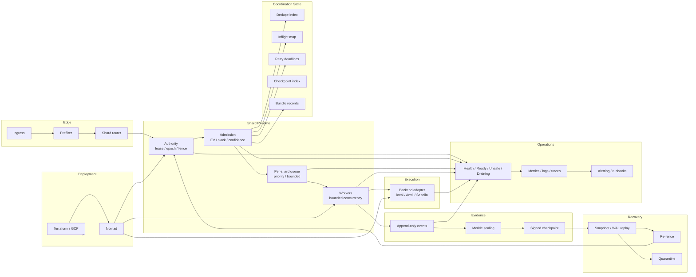

# v3 Architecture

The relay is shard-local. Bundles enter through ingress, get routed by shard key, and then move through authority, admission, queueing, execution, evidence, and recovery.

## Current flow

- ingress handles size checks and rejects junk.
- prefilter handles duplicate and freshness checks.
- router uses rendezvous hashing over canonical bundle ID, network ID, and target slot.
- authority is lease, epoch, and fence token.
- admission gates on EV, slack, and confidence.
- queueing is bounded per shard.
- workers run with bounded concurrency per shard.
- backend access goes through local, Anvil, or Sepolia adapters.
- evidence is append-only events, Merkle sealing, and signed checkpoints.
- recovery uses snapshot, WAL, checkpoint replay, then re-fencing.
- operations cover health, metrics, traces, alerting, and runbooks.

## Invariants in the code path

- one owner per shard at a time
- stale writers fail on every write path
- retries remain bounded
- one terminal path per bundle
- recovery does not rejoin before re-fencing
- health fails closed when authority or dependency state is unsafe
- state transitions reuse returned records instead of rereading after each hop
- event and checkpoint payloads are encoded once for WAL writes
- WAL compaction stays off the common path until the log is well past the bound

## Live structures

- routing table
- lease / epoch / fence records
- exact dedupe map
- per-shard priority queue
- inflight map
- retry deadlines
- append-only event log
- checkpoint index

## Offline structures

- SCC and reachability
- min-cut / flow
- replay graph checks

## Diagram

