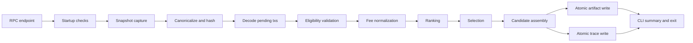
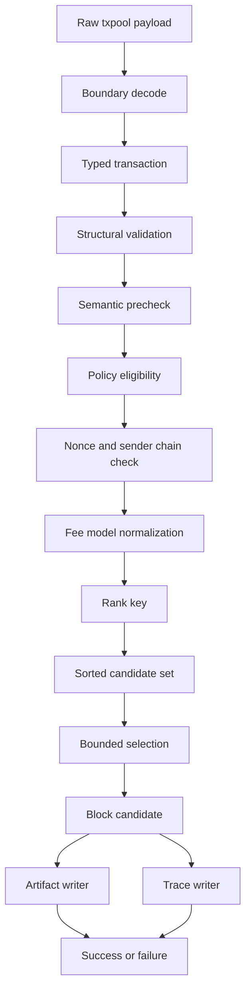

# TxPool Builder v1 Spec

## Problem
`v0` is a demo pipeline, not a production-aware builder.

Known `v0` facts:
- one RPC endpoint: `GETH_RPC_URL=http://geth:8545`
- one input method: `txpool_content`
- one output file: `pseudo_block.json`
- one ranking key: gas price
- one hard cap: `50` transactions

Known `v0` gaps:
- raw decode into `map[string]interface{}`
- unchecked type assertions
- `log.Fatalf` on RPC and write failure
- no nonce, sender, or balance policy
- no gas cap
- no runtime cap
- no memory cap
- no trace artifact
- no health/status/build API
- no failure taxonomy
- no replay contract
- no deterministic artifact identity

`v1` must keep the pipeline small and make behavior typed, bounded, deterministic, and safe to run.

## Decoded math and physics reality
- One run consumes one txpool snapshot.
- A txpool snapshot is local node state, not canonical network truth.
- Transactions are atomic.
- Validity means pre-execution eligibility, not execution success.
- The builder does not guarantee canonical inclusion.
- The builder does not prove that a transaction will execute successfully.
- The builder does not prove that a transaction is affordable from state.
- The builder does not prove that the txpool is complete.
- The current code only guarantees a count cap of `50`.
- Everything else must be made explicit.

## FRs
- Connect to one configured Ethereum RPC endpoint.
- Fetch `txpool_content`.
- Decode only `pending` txs in baseline `v1`; `queued` is out of scope.
- Decode pending txs into typed transactions.
- Validate each tx before ranking.
- Rank valid txs deterministically.
- Select under explicit gas and count bounds.
- Write one machine-readable candidate artifact.
- Record one primary reason for each rejected tx.
- Fail explicitly on upstream, decode, validation, invariant, timeout, or write errors.

## NFRs

### Qualities
- Deterministic: same snapshot + same policy + same binary => same selected tx order.
- Correct: invalid txs are not selected.
- Explainable: every rejected tx has exactly one primary reason code.
- Safe: no success artifact after upstream, decode, invariant, timeout, or persistence failure.
- Small: one run, one snapshot, one candidate artifact, one trace artifact.
- Operable: behavior is inspectable from logs, trace, exit status, and artifact content.

### Scale
- Input source: `1` RPC endpoint.
- Snapshot per run: `1`.
- Candidate artifact per run: `1`.
- Trace artifact per run: `1`.
- Baseline count cap in `v0`: `50`.
- `v1` stays bounded enough for a local machine or small VM.

### Constraints
- `max_transactions` is a hard cap.
- `max_gas` is a hard cap.
- runtime is bounded by timeout.
- memory use must fit the target machine.
- artifact size must stay bounded.
- raw snapshot size must stay bounded.
- no unbounded concurrency.
- no distributed coordination.
- no silent retry loop.
- no database in baseline `v1`.

### Baseline release decisions
- CLI only.
- HTTP is not required for baseline `v1`.
- `pending` only.
- `queued` is out of scope.
- Legacy, access-list, and EIP-1559 txs are supported if they can be normalized from `txpool_content`.
- Blob txs are out of scope for baseline `v1`.
- Contract creation txs are supported if `to = nil` and intrinsic gas rules pass.
- Signature re-verification is out of scope; txpool admission by Geth is treated as the signature gate.
- Chain ID is captured and checked against config at startup.
- Sender balance checks are out of scope; v1 does not prove affordability from account state.
- Base fee is fetched and used when the chain supports it.
- Candidate output is block-like, not an executable block.

### Open definitions required at startup
- timeout value.
- memory ceiling.
- artifact size ceiling.
- snapshot size ceiling.
- retry policy.
- retention policy.
- policy version.
- chain ID.
- artifact directory.
- strict mode / partial decode mode.

## Core entities

### Snapshot
Immutable input view.

Fields:
- `snapshot_id`
- `schema_version`
- `source_endpoint`
- `captured_at`
- `head_before`
- `head_after`
- `head_drift`
- `chain_id`
- `client_version`
- `fetch_duration_ms`
- `raw_payload_digest`
- `raw_pending_count`
- `raw_queued_count`
- `raw_pending_payload`
- `raw_snapshot_path`
- `raw_snapshot_size_bytes`

Contract:
- identifies one txpool view
- replayable only if raw snapshot or equivalent serialized snapshot is retained
- fails if raw snapshot exceeds configured max size
- fails if head drift is non-zero in baseline strict mode

### Transaction
Canonical internal tx model.

Fields:
- `hash`
- `from`
- `to`
- `nonce`
- `tx_type`
- `gas_limit`
- `max_fee_per_gas`
- `max_priority_fee_per_gas`
- `gas_price`
- `value`
- `input_len`
- `access_list`
- `raw_metadata`

Contract:
- typed before validation and ranking
- invalid or unsupported fields never reach selection

### ValidationResult
Per-tx decision.

Fields:
- `tx_hash`
- `accepted`
- `reason_code`
- `reason_detail`
- `stage`
- `rank_key`

Contract:
- exactly one primary reason code per rejected tx
- earliest failed stage owns the primary reason code
- later stages cannot overwrite the primary reason code

### Policy
Versioned rule set.

Fields:
- `policy_version`
- `schema_version`
- `ranking_rule`
- `tie_break_rule`
- `max_transactions`
- `max_gas`
- `max_snapshot_txs`
- `max_raw_snapshot_bytes`
- `max_artifact_bytes`
- `max_trace_bytes`
- `timeout_ms`
- `sender_constraints`
- `reject_on_partial_decode`

Contract:
- policy version is part of output identity
- required config values are startup failures if missing
- ranking cannot override validity or sender constraints

### BlockCandidate
Output artifact content.

Fields:
- `candidate_id`
- `schema_version`
- `policy_version`
- `binary_version`
- `config_digest`
- `snapshot_id`
- `selected_txs`
- `tx_count`
- `total_gas`
- `estimated_priority_revenue`
- `created_at`
- `trace_ref`

Contract:
- derived from exactly one snapshot and one policy version
- bounded by configured limits
- not claimed to be executable

### DecisionTrace
Audit record.

Fields:
- `trace_id`
- `schema_version`
- `snapshot_id`
- `candidate_id`
- `policy_version`
- `binary_version`
- `config_digest`
- `decode_failures`
- `validation_failures`
- `policy_rejections`
- `capacity_exclusions`
- `ranking_order`
- `selection_order`
- `rejection_summary`
- `selection_stop_reason`
- `final_summary`

Contract:
- explains why each tx was accepted or rejected
- links input snapshot to output candidate
- is required for a successful run
- if trace would exceed configured max size, the run fails

## API

Baseline interface:
- CLI only

CLI inputs:
- environment variables
- optional JSON config file
- optional flags

CLI outputs:
- stdout summary
- stderr errors
- candidate artifact
- trace artifact
- exit code

Optional HTTP API is out of baseline scope.

CLI rules:
- one build request maps to one build run
- no unbounded concurrency
- no mutable remote state
- required runtime bounds must be provided
- startup fails if config is incomplete

Required CLI/runtime behavior:
- `--config`
- `--output`
- `--trace-output`
- `--snapshot-output`
- `--replay-snapshot`
- `--compare-candidate`
- `--rpc-url`
- `--timeout`
- `--max-transactions`
- `--max-gas`
- `--max-snapshot-txs`
- `--max-raw-snapshot-bytes`
- `--max-artifact-bytes`
- `--max-trace-bytes`
- `--policy-version`
- `--chain-id`
- `--strict`
- `--reject-on-partial-decode`
- `--allow-head-drift`
- `--include-queued`
- `--no-write`
- `--dry-run-config`
- `--version`
- `--print-config`

## DataFlows

1. Load config.
2. Validate config.
3. Connect RPC.
4. Check `txpool_content` availability.
5. Check `eth_blockNumber`.
6. Check `eth_chainId`.
7. Check sync status.
8. Check artifact directory writability.
9. Fetch snapshot.
10. Record pre-head block number.
11. Fetch `txpool_content`.
12. Record post-head block number.
13. Fail if head drift is non-zero in strict mode.
14. Canonicalize snapshot.
15. Hash snapshot with SHA-256.
16. Store snapshot if within size bound.
17. Decode pending txs.
18. Validate txs.
19. Rank eligible txs.
20. Select under bounds.
21. Assemble candidate.
22. Persist candidate artifact atomically.
23. Persist trace artifact atomically.
24. Emit summary and exit code.

### Invariants
- same snapshot + same policy + same binary => same selected tx order
- no selected tx may violate configured gas/count bounds
- every rejected tx has exactly one primary reason code
- fee ranking must never override nonce, sender, or eligibility constraints
- no successful artifact may be emitted after upstream, decode, invariant, timeout, or persistence failure

### Guarantees
- decode failure cannot become a successful build
- rejected tx cannot enter the candidate
- selection stops before bounds are exceeded
- replay is possible only if the raw snapshot or equivalent serialized snapshot is retained
- successful candidate implies all earlier stages completed without invariant failure
- if multiple rejection conditions exist, the earliest failed stage owns the primary reason code
- later stages cannot overwrite the primary reason code

## HLD -> satisfy FRs

- Startup checks satisfy the input contract.
- Canonicalization and hashing satisfy snapshot identity.
- Decode and validation satisfy typed input and reject paths.
- Ranking and selection satisfy deterministic bounded construction.
- Artifact write satisfies output.
- Trace satisfies explainability and replay.

## LLD -> satisfy FR and DataFlows

### State machine
- `Idle`
- `ValidatingConfig`
- `Connecting`
- `CheckingRPC`
- `Snapshotting`
- `Canonicalizing`
- `Decoding`
- `Validating`
- `Ranking`
- `Selecting`
- `Assembling`
- `Persisting`
- `Completed`
- `Failed`

### Lifecycle model
- One run takes one snapshot.
- One snapshot produces one candidate or one failure.
- The pipeline is single-pass.
- No hidden mutable state carries across runs.

### Language choice
- Go fits the current repo, RPC handling, and typed pipeline without extra runtime cost.

### Primitive usage
- structs for entities
- slices for ordered sets
- maps only for lookup/indexing
- `error` for failure propagation
- `context.Context` for timeout and cancel
- `big.Int` for fee math

### API details
- baseline `v1` is CLI only
- request ID is a run ID in logs and trace
- version headers are only relevant if HTTP is added later
- `--print-config` prints resolved config and config digest

### Fee math
If the chain supports EIP-1559:
- `effective_gas_price = min(max_fee_per_gas, base_fee_per_gas + max_priority_fee_per_gas)`
- `effective_tip = effective_gas_price - base_fee_per_gas`
- `effective_tip = min(max_priority_fee_per_gas, max_fee_per_gas - base_fee_per_gas)`
- if `max_fee_per_gas < base_fee_per_gas`, reject as `INSUFFICIENT_EFFECTIVE_FEE`

If the tx is legacy:
- `effective_gas_price = gas_price`
- if `base_fee_per_gas` exists, `effective_tip = gas_price - base_fee_per_gas`
- if `gas_price < base_fee_per_gas`, reject as `INSUFFICIENT_EFFECTIVE_FEE`

Selection score:
- `score(tx) = effective_tip(tx) * gas_limit(tx)`

This score is a deterministic revenue proxy.

## Deep dive design

This section makes the HLD, LLD, FRs, and NFRs true.

### Scope boundaries
- `v1` validates pre-execution eligibility, not execution success.
- `v1` does not guarantee canonical inclusion.
- `v1` only uses `pending`.
- `queued` is out of scope.
- `v1` does not prove account balance affordability.
- `v1` does not re-verify signatures cryptographically.
- `v1` does not guarantee the txpool is complete or fresh.
- `v1` does not claim to output an executable block.

### Input contract
- `txpool_content` is the exact RPC method.
- Required startup checks: `txpool_content`, `eth_blockNumber`, `eth_chainId`, sync status, config validity, artifact directory writability.
- Capture `head_before` and `head_after`.
- If `head_before != head_after`, mark the snapshot stale and fail in strict mode.
- Capture `client_version` if available.
- Capture fetch duration.
- Capture raw pending count and raw queued count separately.

### Snapshot semantics
- `snapshot_id = SHA-256(canonical_snapshot_bytes)`
- canonicalization sorts object keys recursively and normalizes transaction ordering by sender, nonce, and hash
- raw snapshot is stored compressed if it fits within `max_raw_snapshot_bytes`
- if raw snapshot exceeds the limit, fail before decode
- if raw tx count exceeds `max_snapshot_txs`, fail before decode
- duplicates by tx hash are deduped
- duplicates are recorded in trace
- same sender and nonce replacement picks the tx with the highest `score`

### Validation stages
1. Decode validation
2. Structural validation
3. Semantic precheck
4. Policy eligibility
5. Sender and nonce chain eligibility
6. Capacity exclusion during selection

Rules:
- top-level malformed RPC response is a run failure
- malformed individual tx is a rejection when `reject_on_partial_decode=true`
- missing hash, sender, nonce, gas limit, or fee fields reject the tx
- invalid hex, numeric overflow, invalid address, nil-unexpected fields reject the tx
- unsupported tx type rejects the tx
- contract creation is allowed when `to=nil`
- zero gas rejects the tx
- gas above configured block gas ceiling rejects the tx
- chain ID mismatch rejects the run at startup
- signature mismatch is not rechecked in v1

### Eligibility semantics
- pre-execution eligibility means the tx has the fields and structure needed for ranking and selection
- eligibility does not mean the tx will execute successfully
- eligibility does not mean the tx will be included in a canonical block
- eligibility does not mean the tx is affordable from state

### Reason-code taxonomy
Run failure codes:
- `CONFIG_ERROR`
- `RPC_UNAVAILABLE`
- `RPC_TIMEOUT`
- `RPC_SCHEMA_ERROR`
- `RPC_UNSUPPORTED_METHOD`
- `CHAIN_ID_MISMATCH`
- `SYNCING_NODE`
- `SNAPSHOT_TOO_LARGE`
- `HEAD_DRIFT`
- `ARTIFACT_WRITE_FAILED`
- `TRACE_WRITE_FAILED`
- `INVARIANT_FAILURE`
- `TIMEOUT`
- `PANIC_RECOVERED`

Tx rejection codes:
- `DECODE_ERROR`
- `UNSUPPORTED_TX_TYPE`
- `MISSING_FIELD`
- `INVALID_HEX`
- `OVERFLOW`
- `INVALID_ADDRESS`
- `INVALID_NONCE`
- `NONCE_GAP`
- `DUPLICATE_NONCE`
- `DUPLICATE_TX`
- `REPLACEMENT_CONFLICT`
- `INVALID_GAS_LIMIT`
- `EXCEEDS_BLOCK_GAS`
- `INVALID_FEE_MODEL`
- `INSUFFICIENT_EFFECTIVE_FEE`
- `POLICY_REJECTED`
- `CAPACITY_EXCLUDED`
- `STALE_SNAPSHOT`

Rules:
- the reason code enum is closed
- reason code schema is versioned
- `reason_detail` is human-readable only
- each rejection has one primary reason code
- every reason code is counted in the summary

### Nonce and sender handling
- group txs by sender
- sort each group by nonce
- same sender same nonce => keep the highest `score`
- lower fee replacement loses with `REPLACEMENT_CONFLICT`
- nonce gap makes higher nonces ineligible
- if a lower nonce is missing from the current sender chain, higher nonces are not eligible
- global ranking cannot bypass sender nonce order
- sender chain selection is greedy and deterministic
- the selected candidate preserves nonce-valid order per sender

### Selection algorithm
Objective:
- maximize estimated priority revenue subject to gas and count bounds

Heuristic:
- greedy selection on `score(tx)` over currently eligible sender-head transactions
- if top candidate does not fit remaining gas, mark it `CAPACITY_EXCLUDED` and continue
- if no eligible candidate fits, stop
- backtracking is out of scope
- knapsack optimization is out of scope

Stop conditions:
- `selected_count == max_transactions`
- `remaining_gas < min_gas_needed`
- no remaining eligible tx fits
- timeout reached
- invariant failure

Outputs:
- selected tx order
- total gas
- estimated priority revenue
- stop reason
- remaining gas
- remaining count

### Determinism
- no map iteration order affects output
- all candidate lists are stable-sorted
- final tie-break is tx hash
- `snapshot_id`, `policy_version`, `binary_version`, and `config_digest` define run identity
- timestamps appear in metadata only
- timestamps do not affect selection
- random IDs are forbidden unless derived from deterministic inputs

Replay equivalence:
- structural equivalence means same selected hashes in same order, same reason codes, same counts, same total gas, and same estimated revenue
- byte-identical replay is only expected if timestamps and other nondeterministic metadata are excluded from the artifact comparison

### Artifact contract
Candidate artifact fields:
- `schema_version`
- `candidate_id`
- `snapshot_id`
- `policy_version`
- `binary_version`
- `config_digest`
- `source_endpoint_label`
- `chain_id`
- `selected_txs`
- `selected_tx_hashes`
- `selected_order`
- `tx_count`
- `total_gas`
- `estimated_priority_revenue`
- `rejected_count`
- `rejection_summary`
- `selection_stop_reason`
- `build_duration_ms`
- `created_at`

Trace artifact fields:
- `schema_version`
- `trace_id`
- `snapshot_id`
- `candidate_id`
- `policy_version`
- `binary_version`
- `config_digest`
- `decode_failures`
- `validation_failures`
- `policy_rejections`
- `capacity_exclusions`
- `ranking_order`
- `selection_order`
- `reason_code_summary`
- `selection_stop_reason`
- `final_summary`

Write rules:
- write to temp file first
- rename atomically
- fail run if candidate write fails
- fail run if trace write fails
- fail if candidate or trace exceeds configured size limit
- no partial success artifact

### Observability
- structured logs only
- stage-tagged logs
- run ID in logs
- snapshot ID in logs
- candidate ID in success logs
- failure class in failure logs
- reason-code summary in logs
- no secret values in logs

### Config design
Precedence:
1. CLI flags
2. environment variables
3. config file
4. defaults

Rules:
- required runtime limits have no implicit defaults
- startup fails if any required bound is missing
- config digest is part of artifact identity
- unknown config keys fail in strict mode
- `--dry-run-config` prints resolved config and exits
- `--version` prints binary version and policy version

### Error handling
- no `log.Fatalf` in library code
- stages return typed errors
- `main` maps typed errors to exit codes
- panic recovery marks the run as `INVARIANT_FAILURE`
- timeout is distinguishable from upstream failure
- cleanup removes partial output or leaves it clearly marked failed

### CLI UX
- one command runs one build
- stdout prints a compact success summary
- stderr prints a compact failure summary
- exit code is stable and documented
- `--output` controls the candidate path
- `--trace-output` controls the trace path
- `--print-config` prints resolved config
- `--version` prints build identity

## Deployment strategy

Target machine:
- local machine
- small VM
- single-container Compose

Cost:
- one builder process
- one RPC source
- one artifact file per run
- one trace file per run
- no database in `v1`

Economy:
- single-pass run
- no distributed dependencies
- no background state
- no silent retries
- local outputs only

Design constraints:
- fast startup
- bounded runtime
- bounded memory
- bounded artifact and trace size
- explicit config
- predictable shutdown
- visible failure

UX:
- one command to run
- one artifact to inspect
- one trace to debug
- one failure message to act on

### Tests when local, live, production aware
Unit:
- decode
- validation
- fee math
- ranking
- tie-break
- nonce chain handling
- selection
- reason codes
- error classes

Property:
- same input => same output
- bounds never exceeded
- rejected txs never selected
- shuffled input does not change result
- duplicates are resolved deterministically

Integration:
- mocked RPC
- malformed payload
- empty pool
- mixed validity
- large snapshot
- replacement conflict
- nonce gap
- base fee present
- base fee missing

Live:
- local Geth
- real txpool fetch
- deterministic artifact generation
- snapshot replay

Production aware:
- RPC timeout
- malformed response
- missing fields
- unsupported tx
- artifact write failure
- trace write failure
- invariant failure
- head drift
- snapshot too large

## Success criteria
- real pending snapshot ingested
- typed transactions decoded
- valid means pre-execution eligible
- invalid txs rejected with reason codes
- same snapshot and policy reproduce selected order
- gas and count caps enforced
- raw snapshot captured or replay explicitly blocked
- candidate artifact written atomically
- trace artifact written atomically
- failure is explicit and safe
- no canonical inclusion claim is made

## Failure criteria
- invalid tx selected
- same input produces different selected order
- failure is swallowed
- rejection has no primary reason code
- fee ranking overrides validity or nonce order
- gas or count bounds exceeded
- hidden state changes output
- success reported with broken artifact
- replay is claimed without retained snapshot
- executable block semantics are claimed

## Risks
- txpool schema drift
- nonce dependency
- snapshot staleness
- map-order nondeterminism
- weak reason-code taxonomy
- fee model mismatch
- overfitting to devnet
- treating txpool as canonical truth
- claiming execution success when only eligibility is known

## Assumptions
- `txpool_content` is enough for baseline `v1`
- `pending` only is sufficient for baseline `v1`
- simple greedy selection is acceptable for baseline `v1`
- one node is enough for baseline `v1`
- no multi-builder coordination is needed
- no full execution simulation is required
- local artifacts are enough for operator trust
- signature admission by Geth is sufficient for baseline `v1`

## Review checks
Answer these before shipping:
- what makes a tx eligible?
- how is determinism guaranteed?
- how are ties broken?
- how is snapshot identity preserved?
- why is this fee score correct enough?
- how are invalid txs excluded?
- how are partial failures handled?
- what proves the output is bounded?
- how is replay possible?
- what is explicitly out of scope?

## Decision register
- Baseline deliverable: CLI only.
- HTTP endpoints are not required for baseline `v1`.
- No in-process retry.
- Retry is an operator action.
- No database.
- No distributed coordination.
- No metrics or alerts required for baseline `v1`.
- Snapshot replay requires the raw snapshot or equivalent serialized snapshot to be retained.
- One rejection reason code per rejected tx, chosen by earliest failed stage.
- Fee ranking never overrides validity, nonce, or sender constraints.
- Missing runtime bounds are startup failures, not runtime defaults.
