# TxPool Builder v2 Spec

## Goal
Build a txpool service that is economical at `50,000 req/s`.

Economical means:
- low CPU per admitted request
- low memory per admitted request
- low disk writes per admitted request
- low RPC calls per admitted request
- low queueing delay
- high snapshot reuse
- high request coalescing
- deterministic output for the same snapshot, policy, and binary

## Why this is economical
The service runs on fixed hardware and fixed upstream capacity. Economy means a request consumes less of those fixed resources while still producing useful output.

For one admitted request:

\[
Cost_{req} = CPU_{req} + HEAP_{req} + DISK_{req} + RPC_{req} + WAIT_{req}
\]

\[
Useful_{req} = 1 \text{ if the request is admitted and produces a deterministic result, else } 0
\]

Economical operation means:

\[
\frac{Cost_{req}}{Useful_{req}} \text{ is low for admitted work}
\]

and

\[
\frac{Useful_{req}}{Cost_{req}} \text{ is high}
\]

The main way to reduce `Cost_req` is to avoid repeating expensive work:
- reuse the same snapshot across many requests
- coalesce duplicate requests into one job
- keep admission cheap
- keep build execution bounded
- keep artifact writes off the hot path

Amortization is the key mechanism.

If one snapshot refresh costs `C_snap_refresh` and serves `N` requests, then:

\[
AmortizedSnapshotCost = \frac{C_{snap\_refresh}}{N}
\]

The same applies to replay, trace writes, and artifact writes.

The design is economical only if `N` is large enough that the amortized cost stays below the per-request budget.

## Non-goals
- optimal packing
- canonical inclusion
- unbounded freshness
- unbounded queueing
- unbounded retry
- distributed coordination across builders

## Architecture

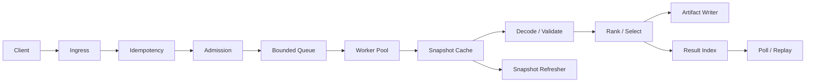

Design rules:
- ingress must be cheap
- admission must be bounded
- build work must be async
- snapshot reuse must be shared
- artifact writes must be off the hot path
- replay must use stored job state

## Cost budget
The service is only economical if all of these are bounded.

These budgets matter because each one is a direct operating cost:
- CPU limits prevent one request from consuming too much compute
- memory limits prevent the process from growing until it swaps or OOMs
- disk limits prevent artifacts and traces from turning into storage backlog
- RPC limits prevent upstream node saturation
- queue limits prevent latency from growing faster than service can drain

The design is economical only if the average cost of useful work stays below the cost of the available hardware and upstream capacity.

### CPU
Per request:
\[
CPU(r) = CPU_{in}(r) + CPU_{id}(r) + CPU_q(r) + CPU_{snap}(r) + CPU_{build}(r) + CPU_{persist}(r) + CPU_{retry}(r)
\]

Budgets:
- `CPU(r) <= CPU_MAX_PER_REQUEST`
- `CPU_BUILD_P99 <= CPU_BUILD_P99_MAX`
- `CPU_REFRESH_P99 <= CPU_REFRESH_P99_MAX`
- `CPU_TOTAL <= CPU_TOTAL_MAX`

### Memory
Memory must be bounded for:
- snapshot cache
- in-flight jobs
- queue
- result index
- traces

Budgets:
- `HEAP_TOTAL <= HEAP_MAX`
- `HEAP_CACHE <= HEAP_CACHE_MAX`
- `HEAP_JOBS <= HEAP_JOBS_MAX`
- `HEAP_QUEUE <= HEAP_QUEUE_MAX`
- `HEAP_RESULTS <= HEAP_RESULTS_MAX`
- `HEAP_TRACES <= HEAP_TRACES_MAX`

### Disk
Disk must be bounded for:
- artifacts
- traces
- replay data

Budgets:
- `DISK_TOTAL <= DISK_MAX`
- `ARTIFACT_BYTES_PER_JOB <= ARTIFACT_BYTES_MAX`
- `TRACE_BYTES_PER_JOB <= TRACE_BYTES_MAX`
- `REPLAY_BYTES_TOTAL <= REPLAY_BYTES_MAX`

### RPC
RPC must be amortized.

Budgets:
- `RPC_CALLS_PER_ADMITTED_REQUEST <= RPC_MAX_PER_REQUEST`
- `RPC_LATENCY_P99 <= RPC_LATENCY_P99_MAX`
- `SNAPSHOT_REFRESH_RATE <= SNAPSHOT_REFRESH_MAX`

### Queue
Queueing must be bounded.

Budgets:
- `Q <= Q_MAX`
- `WAIT_P99 <= WAIT_P99_MAX`
- `IN_FLIGHT_JOBS <= JOB_MAX`

If any budget is exceeded, the service sheds, delays, or fails closed.

## Data model

### Request
Fields:
- `request_id`
- `idempotency_key`
- `priority_class`
- `policy_version`
- `submitted_at`

### Job
Fields:
- `job_id`
- `request_id`
- `snapshot_id`
- `policy_version`
- `state`
- `started_at`
- `completed_at`

### Snapshot
Fields:
- `snapshot_id`
- `captured_at`
- `policy_version`
- `binary_version`
- `basefee`
- `mempool_digest`
- `fresh_until`

### Artifact
Fields:
- `artifact_id`
- `job_id`
- `tx_count`
- `total_gas`
- `artifact_uri`
- `trace_uri`

### Result
Fields:
- `request_id`
- `job_id`
- `state`
- `artifact_uri`
- `trace_uri`

## Txpool model
Model the txpool as a directed graph:

\[
G_t = (V_t, E_t)
\]

where:
- `V_t`: pending transactions
- `E_t`: nonce order, replacement, invalidation

Per transaction:
- `sender`
- `nonce`
- `gas`
- `weight`
- `validity`

Rules:
- invalid transactions are dropped before selection
- same sender and nonce are reduced locally
- sender nonce order must hold in the selected set
- local prune does not decide the final result

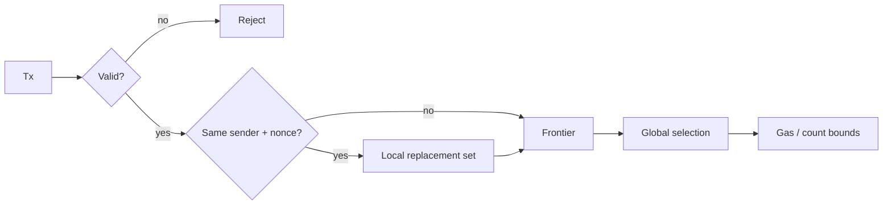

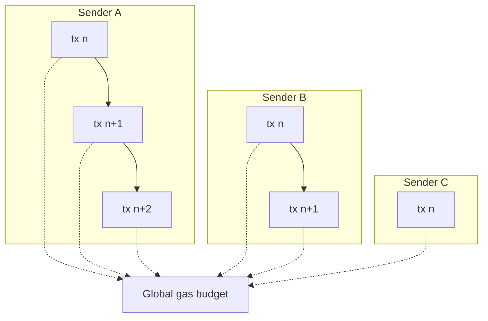

## Selection model
Selection is:
1. validate
2. group by `(sender, nonce)`
3. prune local duplicates
4. rank by deterministic score
5. apply sender feasibility
6. stop at gas or count limit

Tie-breaks:
- tx hash
- then stable input order

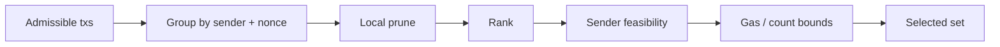

## Snapshot model
One snapshot is reused across many requests until it is invalidated.

Invalidate when:
- age exceeds `T_FRESH`
- mempool digest changes
- basefee changes beyond policy
- policy version changes
- binary version changes

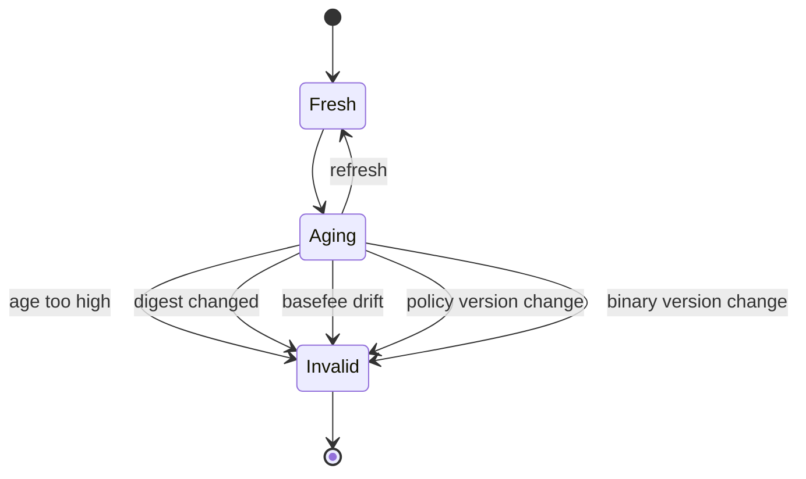

## Admission model
Admission is fixed and cheap.

Admission classes:
- high
- normal
- low

Rules:
- FIFO inside class
- higher class may bypass lower class under load
- class is part of the request
- full class sheds or delays
- no request bypasses queue limits

Admission decisions use:
- queue depth
- class
- idempotency state
- snapshot freshness
- worker availability

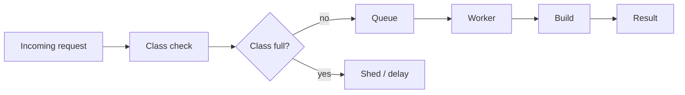

## Control policy
Use simple bounded control, not a continuous utility controller.

Controls:
- refresh cadence
- admission threshold
- queue limit
- worker limit

Observed:
- queue depth
- snapshot age
- admitted rate
- build rate
- RPC latency
- artifact latency
- shed rate

Actions:
- refresh on fixed cadence plus invalidation
- shed when queue hits `Q_MAX`
- cap workers at `WORKER_MAX`
- stop refresh when RPC budget is exceeded
- fail closed when cache coherence breaks

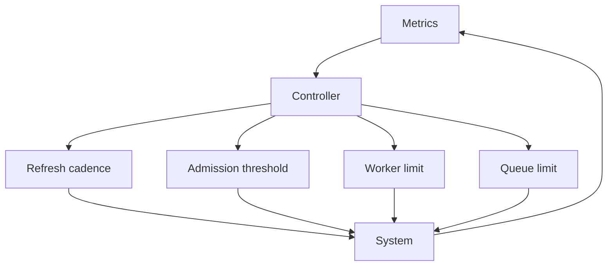

## Runtime contracts

### Request semantics
- one request has one `request_id`
- one request has one `idempotency_key`
- one request maps to at most one job
- repeated submission of the same idempotency key resolves to the same job or result
- request admission returns quickly with accept, shed, or delay
- request admission does not wait for build completion
- request admission does not fetch txpool data directly
- request admission does not write artifacts
- request bodies are rejected before queueing if malformed

State:
- `Received`
- `Validated`
- `Admitted`
- `Shed`
- `Delayed`
- `Rejected`

Transition rules:
- malformed request -> `Rejected`
- duplicate idempotency key -> reuse existing job or result
- queue full -> `Shed` or `Delayed`
- accepted request -> `Admitted`

### Snapshot epoch semantics
- each snapshot has one `snapshot_id`
- each snapshot belongs to one policy epoch and one binary epoch
- a job uses one snapshot ID for its full execution
- admission and build must read the same snapshot epoch
- snapshot reuse stops when age, digest, policy, or binary epoch changes
- snapshot refresh creates a new epoch, not a mutable in-place update
- a worker must not mix data from two snapshot epochs in one job
- a replay must target the same snapshot epoch as the original job

State:
- `Fresh`
- `Aging`
- `Invalid`
- `Refreshed`

Transition rules:
- refresh -> `Refreshed`
- age or drift beyond policy -> `Invalid`
- policy change -> `Invalid`
- binary change -> `Invalid`

### Idempotency semantics
- idempotency lookup happens before queue admission
- duplicate request keys must not create duplicate jobs
- idempotency records are retained long enough to cover retries
- idempotency collisions resolve deterministically
- idempotency records expire only after the retry window
- a collision returns the original job or result handle
- idempotency lookup must be O(1) expected time

State:
- `Miss`
- `Hit`
- `Expired`
- `Conflict`

### Queue semantics
- queue depth is bounded
- queue order is deterministic within priority class
- higher priority classes may bypass lower priority classes under load
- a full queue sheds or delays by policy
- queued work must not grow without bound
- queue capacity is fixed
- queue entries are immutable after admission
- queued requests do not mutate snapshot state
- queue draining is FIFO within class unless policy says otherwise

State:
- `Empty`
- `Open`
- `Saturated`
- `Shedding`
- `Draining`

### Async persistence semantics
- artifact and trace writes happen after selection
- persistence is off the request path
- failure to persist marks the job failed unless policy allows spill
- partial writes are not published as successful results
- result visibility requires a persisted artifact or a declared degraded mode
- artifact write is atomic at the file or object level
- trace write is capped independently from artifact write
- replay reads only committed artifacts and traces
- persistence backlog is visible as a metric

State:
- `Pending`
- `Writing`
- `Committed`
- `Spilled`
- `Failed`

### Degraded-mode semantics
Degraded mode is entered when one of these exceeds policy:
- queue depth
- RPC latency
- snapshot age
- artifact latency
- retry rate

In degraded mode:
- request admission may shed earlier
- snapshot refresh may pause or slow
- result visibility may lag
- trace output may be reduced or capped
- failed writes may spill or fail closed by policy
- admission classes may be clamped to high-priority only
- low-priority requests may be dropped first
- replay may be disabled if result state is incomplete
- cache refresh may be paused if RPC budget is exhausted

Exit conditions:
- queue depth below threshold
- RPC latency below threshold
- snapshot age below threshold
- artifact latency below threshold
- retry rate below threshold

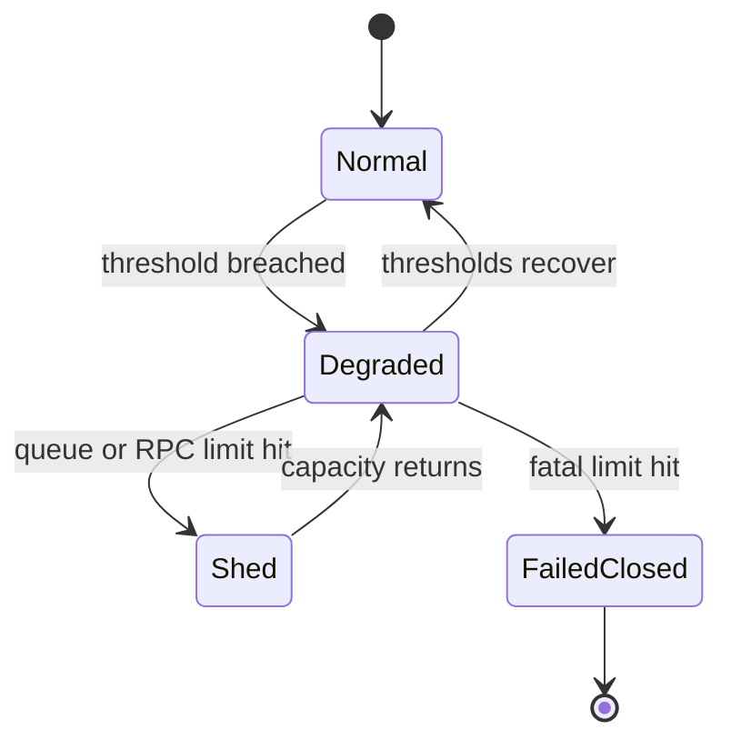

## Cost model
The cost of a request is:

\[
C(r) = t_{in}(r) + t_{id}(r) + t_q(r) + t_{snap}(r) + t_{build}(r) + t_{persist}(r) + t_{retry}(r)
\]

Where:
- `t_in`: request parsing and validation time
- `t_id`: idempotency lookup time
- `t_q`: queue wait time
- `t_snap`: snapshot lookup or refresh time
- `t_build`: decode, validate, rank, select time
- `t_persist`: artifact and trace write time
- `t_retry`: retry and replay time

Tradeoffs:
- higher queue wait lowers admission pressure but raises latency
- higher snapshot reuse lowers RPC cost but raises stale risk
- larger traces improve review but raise disk cost
- more coalescing lowers duplicate work but lowers request isolation
- more shedding lowers queue growth but rejects more work

## Risk model
Main risks:
- admission overload
- RPC saturation
- freshness drift
- retry storm
- artifact backlog
- idempotency contention
- dominance churn
- fairness skew
- split snapshot epochs
- tail fragmentation

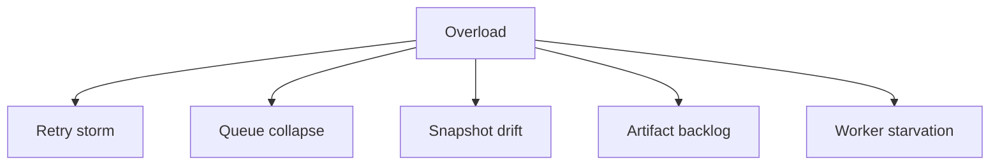

Risk controls:
- hard queue limits
- hard worker limits
- snapshot invalidation
- bounded retries
- explicit shedding
- atomic cache updates
- deterministic tie-breaks

## Live risk simulation
Run live tests with:
- burst arrivals at and above `50,000 req/s`
- slow RPC responses
- cache invalidation during active build
- artifact store slowdown
- duplicate request spikes
- retry bursts after transient failure

Measure:
- admission latency
- build latency
- queue depth
- worker saturation
- stale snapshot rate
- shed rate
- retry rate
- artifact backlog

If thresholds are crossed:
- queue over limit -> shed
- snapshot age over limit -> invalidate cache
- RPC over budget -> stop refresh
- artifact over budget -> fail writes or spill
- retry over budget -> fail closed

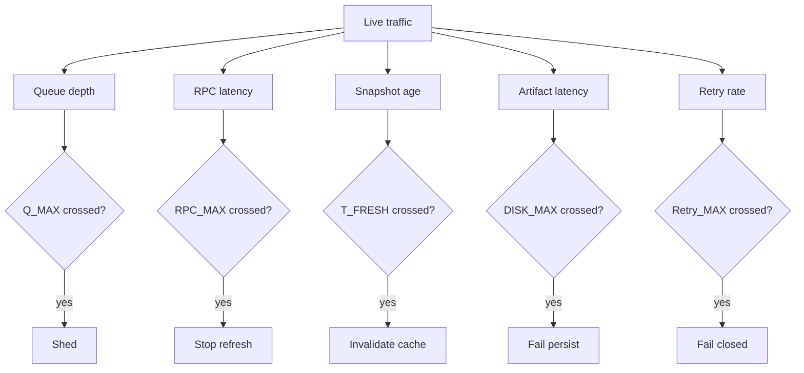

## Metrics
The service must report:
- `admission_latency_p99`
- `build_latency_p99`
- `queue_depth_max`
- `snapshot_age_p99`
- `rpc_calls_per_admitted_request`
- `artifact_bytes_per_request`
- `coalesce_ratio`
- `duplicate_request_rate`
- `shed_rate`
- `stale_snapshot_rate`
- `dominated_prune_rate`
- `gas_utilization`
- `count_utilization`

## Review rules
Minimum review contract:
- each admitted request maps to one job record
- each job has one snapshot ID and one policy version
- each rejected request has one primary reason code
- each candidate is deterministic for the same snapshot, policy, and binary
- each overload event is visible in metrics

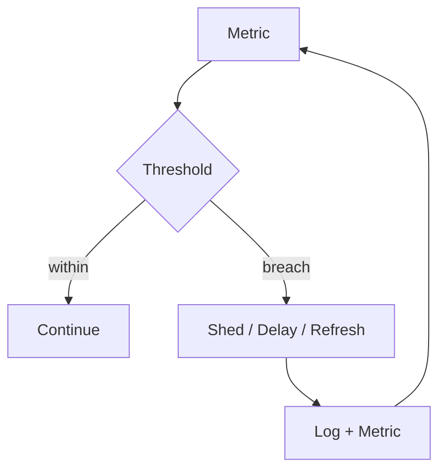

## Failure behavior
The design fails if:
- every request triggers live RPC
- queue depth grows without bound
- artifacts collide
- result lookup is ambiguous
- idempotency is absent
- overload collapses the process
- stale snapshot usage is not observable
- replay produces a different selected order for the same inputs

## Risk register

| Risk | Failure mechanism | Impact | Signal | Mitigation | Fatal |
|---|---|---|---|---|---|
| Admission overload | arrivals stay above build capacity | queue growth, latency breach | queue depth, p99 admission latency, shed rate | bounded queue, admission threshold | yes |
| RPC saturation | refresh competes with build traffic | stale cache, slow builds | RPC latency, snapshot age, RPC/request ratio | refresh cap, cache reuse, RPC budget | yes |
| Freshness drift | cache stays valid too long | low-value output, replay mismatch | snapshot age, stale rate, replay diff rate | invalidation, refresh | yes |
| Retry storm | failures trigger repeated retries | queue collapse, store amplification | retry rate, shed rate, queue depth | retry cap, fail closed | yes |
| Artifact backlog | persist rate below build rate | result lag, storage pressure | artifact latency, artifact bytes/request | async writes, artifact budget | yes |
| Idempotency contention | hot keys or duplicate writes | admission slowdown | duplicate rate, id latency | sharding, TTL, coalescing | no |
| Dominance churn | many near-equal replacements | build cost, trace growth | prune rate, trace bytes, build latency | strict prune, frontier cap | no |
| Fairness skew | class priority favors a subset | starvation, tenant imbalance | per-client admit rate, wait distribution | weighted fair sharing, quotas | no |
| Split snapshot epochs | admission and worker see different cache versions | replay ambiguity | epoch mismatch, replay diff rate | atomic cache entry, epoch pinning | yes |
| Tail fragmentation | small overloads compound into outages | nonlinear failure | tail latency, queue depth, worker starvation | hard caps, early shedding | yes |

Decision rule:
- fatal risk above threshold -> shed or fail closed
- non-fatal risk above threshold -> reduce rate, rebalance, or isolate

Thresholds are policy values:
- `queue_depth > Q_MAX`
- `snapshot_age > T_FRESH`
- `rpc_calls_per_admitted_request > RPC_MAX_PER_REQUEST`
- `artifact_bytes_per_request > ARTIFACT_BYTES_MAX`
- `latency_p99 > L_MAX`
- `retry_rate > RETRY_MAX`
- `duplicate_request_rate > DUP_MAX`

## Non-goals
- exact optimal packing
- canonical inclusion
- distributed coordination across builders
- unbounded freshness
- unbounded queueing
- unbounded retry
- hidden backpressure
