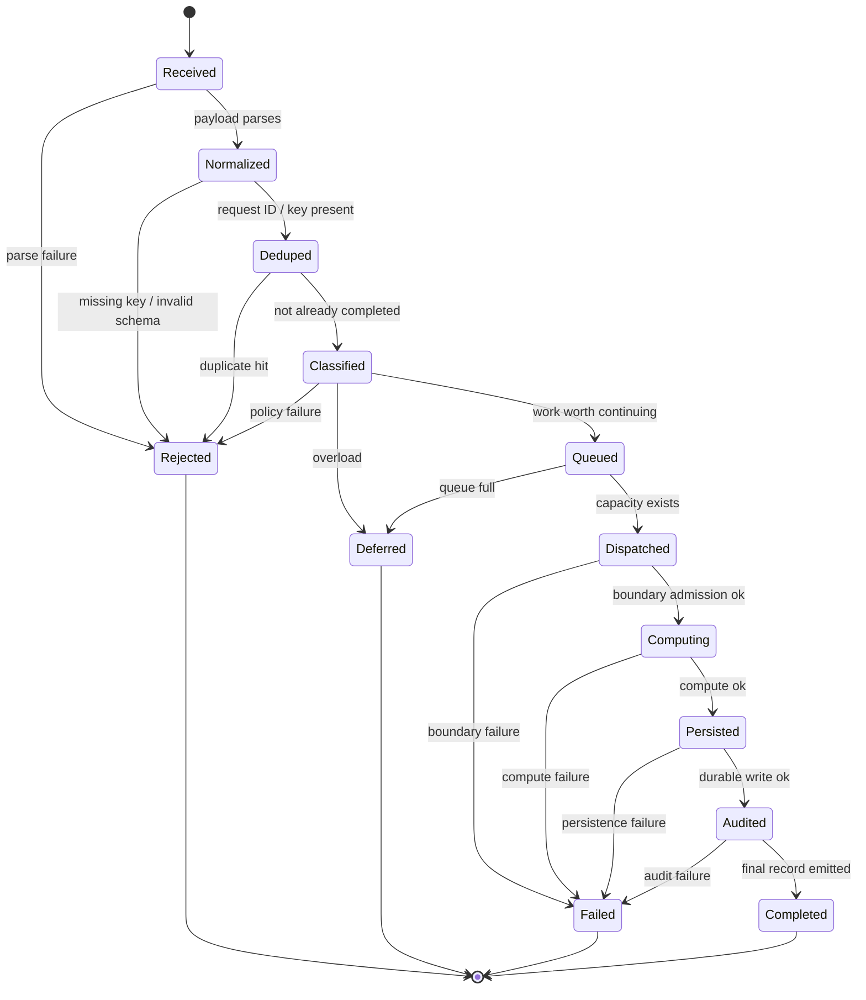
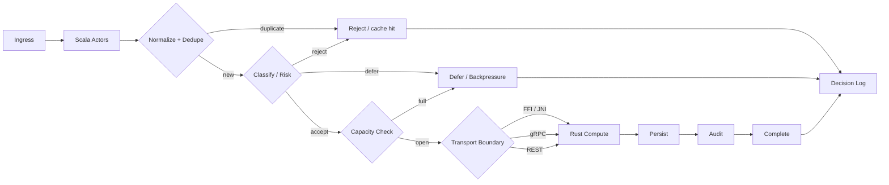
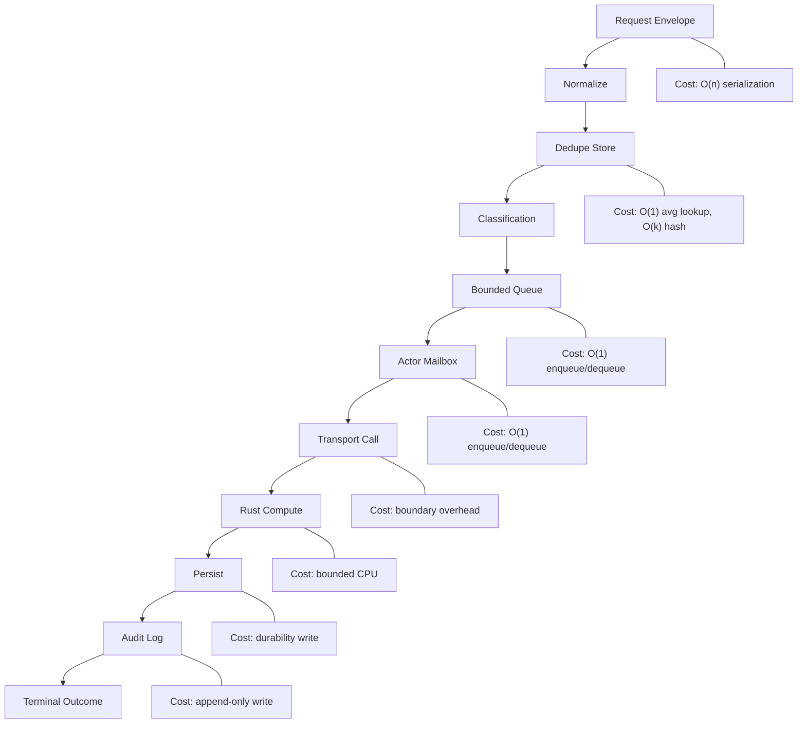

# v1 Reality

## Problem

This system is a bounded request state machine. Scala owns the state transitions, Rust owns the expensive numeric work, and the live object is the in-flight request moving through a finite set of states. The economic rule is subordinate to the state machine: offload only when measured compute saved exceeds boundary, validation, and failure cost.

Primary workload:
- off-chain swap decisioning
- quote / route / slippage / breakeven compute
- request dedupe and replay-safe decisioning
- audit and recovery around pre-trade requests

- observed now: v0 is in-process Scala only
- observed now: no measured cross-runtime cost
- observed now: no Rust boundary yet
- v1 operating requirement: swap-like requests and related Solana workflows
- v1 operating requirement: decide once
- v1 operating requirement: offload only the expensive part
- v1 operating requirement: keep the system bounded and measurable
- v1 operating requirement: every request is typed, observable, auditable, and replay-safe

## Operational truth

What is true now:
- v0 is in-process Scala only
- v0 does not have a Rust boundary
- v0 does not measure cross-runtime cost
- v0 does not have durable request identity or replay contracts in the live shape required by v1
- v0 does not have production-grade per-key serialization and bounded queue semantics

What v1 must make true:
- every request has a typed identity and one terminal outcome
- the state machine is explicit and bounded
- the boundary is explicit and measurable
- the decision record is durable and replayable
- observability and auditability are mandatory outputs, not optional logs

Live request shape:
- one request is one swap-preflight decision request
- the request is keyed by request ID and dedupe key
- the request carries token pair, amount, route candidates, freshness state, and source hashes
- the terminal response is accept, defer, or reject
- a response is only a decision; it is not the swap execution itself

What is not yet true until measured:
- exact boundary overhead
- exact route-scoring cost
- exact freshness window for each market condition
- exact p50/p95/p99 latency
- exact byte cost per request
- exact capacity ceiling under skew and hot keys

State machine reality:
- requests move through `received -> normalized -> deduped -> classified -> queued -> dispatched -> computing -> persisted -> audited -> terminal`
- each transition has a guard, a cost, and a terminal failure path
- every request ends in exactly one terminal outcome
- every duplicate request resolves to a recorded terminal state, not a new execution
- the machine is the control plane; compute is an implementation detail of one transition

## Typed model

Typed values:
- `RequestId`: opaque string, unique per request
- `DedupeKey`: opaque string, idempotency key
- `RequestState`: finite enum
- `TerminalState`: finite enum
- `WorkItem`: normalized request payload
- `Decision`: terminal state plus reason and metadata
- `Slot`: integer Solana slot number
- `SlotAge`: `current_slot - quote_slot`
- `Budget`: CPU, memory, wait, retries
- `RouteId`: opaque venue or path identifier
- `RiskScore`: normalized scalar
- `Quote`: expected output, slippage, fee, route score
- live request class: one swap-preflight decision per request ID, keyed by token pair, amount, route candidates, and freshness window

Typing rules:
- request identity is typed and mandatory
- state is typed and finite
- terminal state is immutable once written
- all numeric outputs carry units or normalized scale

Quantitative rules:
- `|RequestId| <= I_max`
- `|DedupeKey| <= K_max`
- route candidate count `<= R_max_routes`
- `SlotAge <= FreshnessMax`
- `|Decision| <= D_max`
- `|AuditRecord| <= A_max`
- `N_inflight(t)` is bounded by queue depth and worker pool size
- `B_req` is the serialized bytes per request envelope + decision + audit metadata
- `B_avg` is the mean bytes per in-flight request
- `M_req` is memory per request, including queue and actor overhead
- `λ` is arrival rate
- `μ_stage` is the service rate of a stage
- `W` is total wait plus service time
- `ρ_stage = λ / μ_stage` for the single-stage approximation
- any quantity without a measured value is a budget placeholder, not an operational fact

## v0 reality

v0 was an in-process Scala toy ledger. `Calculator.addAmount` returned a new `Map[String, Double]` with a balance incremented by a numeric amount. `Calculator.subtractAmount` returned either an error or a new `Map[String, Double]` with a decremented balance, and the only domain checks were “address exists” and “balance does not go below zero.” There was no request envelope, no request identity, no terminal decision record, no durable state, no transport boundary, no Rust worker, no queue, no audit log, and no replay contract.

The multithreaded path did not change that. `MultithreadedCompute` split random add/subtract work across Futures on the global execution context, but it still operated on the same in-memory account map shape. The comments even note the missing thread-safety problem: updated state would need explicit protection if it were mutable. The integration test goes further and mutates a shared `var accounts` inside concurrent Futures. That is not a concurrency control plane; it is a race-prone shared-memory experiment with print statements and a non-durable end state.

The v0 README also overclaimed the runtime shape. It described multithreaded computation and load validation, but it did not demonstrate a production transport, a persistent boundary, measured load, or a request lifecycle. It was a local computation demo with concurrent Futures, not a bounded request service.

What v1 must add:
- a request envelope with request ID, dedupe key, source hashes, and freshness state
- a finite state machine with one terminal outcome per request
- a durable decision record and replay lookup
- a real transport boundary to Rust
- queue bounds, worker bounds, and per-key serialization
- observability, auditability, and recovery contracts
- economic gates for accept, defer, and reject

What v1 must replace:
- shared mutable state with serialized transitions
- implicit in-memory final state with durable terminal state
- random concurrent map mutation with bounded request processing
- “load test” language with measured throughput, latency, and failure behavior

## Functional requirements

The service must accept requests through Scala orchestration, normalize before decision, dedupe by request ID or idempotency key, classify into a terminal outcome, offload only when the measured cost delta is positive, preserve deterministic outcome for the same normalized input and state snapshot, bound retries and queue depth, and emit one durable decision record per request. In other words, each functional requirement is a transition contract in the state machine.
If a contract cannot be enforced or measured, it is not operational truth.
The live decision is forward, defer, or reject on a single swap-preflight request. It is not trade execution.

If any of those are missing, the failure mode is explicit:
- no Scala orchestration means no owner for policy and retries
- no normalization means non-canonical inputs diverge
- no dedupe key means duplicate side effects
- no terminal classification means no deterministic end state
- no positive cost delta means the offload is economically wrong
- no determinism for the same normalized input and state means replay drift
- no bounded retries or queue depth means failure amplification
- no decision record means no audit trail

## Idempotency

Rules:
- each request has one request ID and one dedupe key
- dedupe check happens before expensive work
- duplicate request returns the recorded terminal outcome
- replay cannot create new state
- missing key or missing state forces reject or fail closed

Invariants:
- one logical request maps to one dedupe key
- duplicate requests cannot mutate state twice
- terminal record is durable before replay can recover outcome
- duplicate request returns recorded outcome
- missing dedupe state is visible, not silent

Idempotency is not just duplicate suppression. It is a replay contract:
- the same request ID must resolve to the same terminal record
- duplicate requests must return the recorded outcome, not a fresh execution
- replay after crash must read durable terminal state first
- a missing terminal record must be visible as `deferred` or `failed`, never hidden
- duplicate side effects are zero by construction
- idempotency is only true when the terminal state is stored before acknowledgment and reloaded before replay

Metrics:
- duplicate hit rate
- dedupe lookup latency
- terminal record durability
- replay drift
- missing-key rate

Idempotency guarantee:
- same request ID cannot produce two terminal side effects
- same normalized input + same state snapshot cannot produce two different terminal outcomes

Idempotency gaps in v0:
- no durable terminal-state store
- no replay lookup
- no request identity contract
- no duplicate suppression contract
- no persisted outcome reuse

v1 change:
- request identity becomes mandatory
- dedupe occurs before work
- terminal outcomes are persisted durably
- replay returns recorded outcomes instead of re-executing work

Terminal outcomes:
- accept
- reject_duplicate
- reject_malformed
- reject_risk
- defer
- fail_closed

## Non-functional requirements

The non-functional contract is boundedness, idempotency, determinism, observability, auditability, failure isolation, backpressure, cost efficiency, latency control, throughput control, recoverability, correctness under replay, measurable performance, upgradeability, deployment isolation, and schema compatibility.

Those requirements mean:
- queue depth, retry count, and wait time are finite
- duplicate side effects are zero
- identical normalized input plus identical state yields the same outcome
- every state transition emits a structured event
- every terminal request emits a durable decision record
- boundary failure cannot corrupt local state
- overload is stopped by backpressure, not hidden by buffering
- offload happens only when measured compute saved exceeds measured boundary and failure cost
- each stage has a bounded residency time
- throughput target is only valid if the slowest stage can sustain it
- recovery replays only non-terminal work
- replay cannot advance state twice
- CPU, allocation, bytes, and I/O are measured per stage
- schema and transport are versioned
- the deployment model matches the transport choice
- invalid schema is rejected, not inferred
- if a requirement cannot be observed, it is not operationally present

The required numeric posture is:
- `Q_max`, `R_max`, and `W_max` are finite and enforced
- `ρ <= 0.7` for normal operation
- `ρ <= 0.85` only for short bursts
- any stage that cannot sustain `277.78 ops/sec` is a bottleneck for the `1,000,000 ops/hour` target
- the throughput target is a budget until measured under the real workload

## Adversarial reality

The service is treated as adversarial by default. Duplicate requests, replay after restart, reordering, delay, malformed payloads, oversized payloads, partial failure, stale reads, partial writes, and burst load all have explicit outcomes.

- duplicate requests resolve to a cached outcome or rejection, never a second execution
- replay resolves from durable terminal state, not a fresh guess
- reordering is tolerated only when per-key serialization preserves correctness
- delay becomes bounded wait or deferment, not silent backlog
- malformed or oversized payloads are rejected before the hot path
- partial failure must fail closed or defer
- stale reads must not drive a terminal economic decision
- partial writes must be recoverable via replay
- burst load must hit backpressure, not unbounded memory growth
- a stall becomes timeout or defer
- a crash becomes a local failure only
- backlog is bounded by `Q_max`
- dropped state requires replay or recovery
- no adversarial condition is allowed to create a silent success

## Concurrency

Concurrency is partitioned, not free-form. Ingress is concurrent, Scala actors are concurrent across keys, the queue is bounded, Rust workers are a bounded pool, and storage writes preserve per-request ordering.

The operating rule is simple:
- requests for independent keys may run in parallel
- requests for the same key are serialized where state consistency requires it
- shared mutable state is not used without an explicit serialization point

The concurrency failure modes in v0 were: no explicit key serialization, shared mutable state in tests, no bounded queue, no explicit worker pool, and no durable terminal-state synchronization. v1 fixes that by partitioning concurrency by request key, serializing state transitions per key, bounding worker count and queue depth, and making replay deterministic under concurrent load.

The concurrency guarantee is:
- parallelism is allowed only across independent keys and bounded workers
- state transitions for the same key are ordered
- concurrency cannot violate idempotency or terminal-state uniqueness

The live math is:
- `N_inflight(t)` is the sum of requests across non-terminal states
- `E[N_inflight] = λ × E[W]`
- actor mailbox depth contributes to in-flight occupancy
- worker pool size bounds the computing state
- queue depth bounds the queued state
- storage writes are serialized per request ID where ordering matters

The measurable indicators are active worker count, per-key queue depth, per-key latency, contention rate, retry amplification rate, and overflow rate.
Those indicators exist because concurrency without measurement is not operational truth.

## In-flight request model

Let `N_s(t)` be the number of requests in state `s` at time `t`.

For non-terminal states `S_nonterminal = {received, normalized, deduped, classified, queued, dispatched, computing, persisted, audited}`:

`N_inflight(t) = Σ_{s ∈ S_nonterminal} N_s(t)`

Per stage:
- mailbox occupancy contributes to `N_queued` or `N_received`
- bounded queue occupancy contributes to `N_queued`
- Rust worker occupancy contributes to `N_computing`
- persistence/audit occupancy contributes to `N_persisted + N_audited`

Little's Law:

`E[N_inflight] = λ × E[W]`

where:
- `λ` = arrival rate
- `E[W]` = mean end-to-end waiting + service time

Per-key serialization:
- for a given key `k`, live in-flight logical work should be bounded to at most one active terminal path per key
- duplicate requests for `k` must map to the recorded terminal outcome, not a second live path

Actor math:
- actor mailbox depth is part of `N_inflight`
- worker pool size bounds the `computing` state
- queue depth bounds the `queued` state
- actor throughput is the service rate of the state transition pipeline, not raw thread count

Byte model:

`B_inflight ≈ N_inflight × B_avg`

`B_avg = B_env + B_quote + B_route + B_decision + B_audit`

`M_inflight ≈ B_inflight + overhead`

Throughput bound:

`Throughput_max ≈ min(μ_received, μ_normalized, μ_deduped, μ_classified, μ_queued, μ_dispatched, μ_computing, μ_persisted, μ_audited)`

Latency decomposition:

`W_total = W_receive + W_normalize + W_dedupe + W_classify + W_queue + W_dispatch + W_compute + W_persist + W_audit`

Per-key rule:
- at most one active live transition chain per key
- duplicates for the same key must map to the recorded terminal state

This is the mathematical picture of the Scala actor system: actor mailboxes, queue capacity, and worker pools are occupancy constraints on a finite-state machine. The service is healthy only when `N_inflight` is bounded, `E[N_inflight] = λ × E[W]` stays within the capacity envelope, and the same key never produces two live terminal paths.

Observability and auditability:
- every request carries `trace_id`, `request_id`, `decision_id`, `model_version`, `route_id`, `slot`, `quote_age`, and `source_hashes`
- every state transition emits one structured event
- every terminal request emits one structured decision record
- audit storage is append-only
- each quote and decision is tied to an immutable version of the inputs and model
- every request must be reconstructible from logs plus the decision store
- observability is measured as 100 percent terminal coverage and 100 percent transition coverage for structured events

Freshness and source of truth:
- quotes are valid only within a slot-age or timestamp-age limit
- stale liquidity, stale fees, stale prices, or stale slot state are not allowed to drive an accept decision
- authoritative sources for liquidity, fees, prices, and slot state must be named and ordered by precedence
- missing or conflicting sources must resolve to defer or reject, never to silent inference
- every decision stores the source hashes and freshness state used to produce it

Testing and proof:
- contract tests prove each transition guard and terminal state
- property tests prove idempotency and replay behavior
- load tests cover burst traffic, hot keys, and skew
- chaos tests inject transport, persistence, and audit failures
- freshness tests verify stale-data rejection
- economic tests verify negative breakeven rejection
- performance measurement must report p50, p95, p99, memory, queue depth, retry rate, duplicate hit rate, and replay drift

Operational control:
- admission control is explicit: requests enter only if queue, worker, and freshness budgets have room
- freshness control is explicit: stale quotes, stale fees, stale liquidity, or stale slot state cannot reach accept
- duplicate control is explicit: request ID + dedupe key must resolve before any expensive work
- boundary control is explicit: gRPC deadlines and payload caps prevent indefinite transport residency
- capacity control is explicit: `Q_max`, `R_max`, `W_max`, and worker pool size are hard caps
- replay control is explicit: replay reads durable terminal state before any recomputation
- audit control is explicit: no terminal outcome is acknowledged until the durable decision record exists
- circuit-breaker control is explicit: transport failure, audit failure, or stale-source failure opens the breaker and forces defer or fail closed
- rollback control is explicit: schema or transport regression disables the affected path until a fixed version is deployed
- kill-switch control is explicit: overload, stale-source failure, persistence failure, or audit failure disables acceptance
- alert thresholds are required for queue depth, error rate, audit failure, freshness failure, duplicate replay, and model-version mismatch
- error budgets are required for transport failure, persistence failure, audit failure, and duplicate replay
- dead-letter handling is only allowed if it preserves replay and auditability
- on-call runbooks are required for transport, persistence, audit, stale-data, duplicate-replay, and overload incidents
- if a control cannot be enforced automatically, the service must fail closed rather than continue on the hot path

Operational health checks:
- queue depth below `Q_max`
- worker utilization below the sustained limit
- actor mailbox depth below the overflow threshold
- dedupe hit rate within expected retry band
- replay drift equals zero for identical state
- audit coverage equals 100 percent for terminal requests
- freshness failure rate below tolerance
- source conflict rate below tolerance
- model-version mismatch rate equals zero
- transport error rate below the retry budget
- p50, p95, and p99 decision latency below configured deadlines
- stale decision rate below the reject threshold
- non-terminal backlog draining as expected
- no silent accept under stale or conflicting source state

Security and isolation:
- requests are authenticated and authorized
- the boundary is encrypted
- request spoofing is prevented
- replay abuse is prevented by identity and dedupe rules
- route poisoning is prevented by source validation and route scoring rules
- audit tampering is prevented by append-only storage and durable writes

## Constraints

Hard constraints:
- no unbounded queue
- no unbounded retry loop
- no silent duplicate side effects
- no unbounded memory growth
- no dependence on Solana consensus internals
- no claim that offload changes on-chain execution rules

Operational constraints:
- normal utilization `ρ <= 0.7`
- degraded utilization `ρ <= 0.85` for short bursts only
- `Q_max` finite
- `W_max` finite
- `R_max` finite

Boundary constraints:
- every boundary crossing has cost
- every serialization step has cost
- every retry multiplies cost
- every failure mode must be visible
- every unmeasured cost remains a hypothesis until profiled

Source quality constraints:
- every quote must name its source set
- every source must have a freshness limit
- conflicting source values require an explicit precedence rule
- stale or incomplete source state cannot silently become an accept decision
- any source without freshness cannot drive a terminal accept

## Invariants

Concrete invariants:
- each request has exactly one request ID
- each request has exactly one dedupe key
- each request maps to at most one terminal outcome
- same normalized input + same state snapshot => same terminal outcome
- only one terminal record exists per request ID
- terminal state is immutable once written
- no transition without a guard
- no transition without a measurable cost
- no hidden state in transport
- per key, transitions are serialized where ordering is required
- duplicate requests do not advance state
- replay cannot create new side effects
- queue depth is finite
- retry count is finite
- wait time is finite
- memory growth is bounded by explicit budget
- decision record exists for every terminal request
- decision record is durable before completion is acknowledged
- offload only if `compute_saved > boundary_overhead + validation_overhead + failure_risk_cost`

## Guarantees

If the invariants hold, the system guarantees:
- one terminal outcome per request ID
- no duplicate side effects for duplicate requests
- bounded queue growth under burst
- bounded retry amplification
- visible failure instead of silent corruption
- deterministic outcome for identical normalized input and state
- auditability of terminal decisions
- local failure containment at the boundary
- rejection or deferment when capacity is exceeded
- offload only when economically justified
- auditability through durable decision records and structured transition events
- observability through end-to-end traceability of request, decision, model, route, slot, and source hashes
- bounded math: the system never claims more than it can measure

## Failure decision table

| Condition | Terminal state | Retry? | Persist audit? | Notes |
|---|---|---:|---:|---|
| Malformed payload | `rejected` | No | Yes | Parse fails or schema invalid |
| Missing dedupe key | `rejected` | No | Yes | Cannot guarantee idempotency |
| Duplicate request | `rejected` | No | Yes | Cached terminal outcome allowed |
| Policy / risk failure | `rejected` | No | Yes | Reject closed |
| Queue full | `deferred` | Yes, capped | Yes | Retry only within `R_max` |
| Boundary admission fails | `failed` | Maybe, capped | Yes | Transport-level failure |
| Rust compute fails | `failed` | Maybe, capped | Yes | Retry only if idempotent |
| Persistence fails | `failed` | Maybe, capped | Yes | Must not acknowledge success |
| Audit write fails | `failed` | Maybe, capped | Yes | No silent completion |
| Recovery replay sees completed ID | `completed` | No | Yes | Idempotent replay |
| Recovery replay sees missing terminal record | `deferred` or `failed` | Maybe | Yes | Depends on checkpoint state |

The decision table is the only place where we allow a compact matrix because it is a true decision axis: the input condition maps to one terminal state and one recovery rule.

## Quantitative targets

Throughput target:
- v2: `1,000,000 ops/hour`
- `1,000,000 / 3600 = 277.78 ops/sec`

Sizing implication:
- if a stage cannot sustain `277.78 ops/sec` at `ρ <= 0.7`, it is a bottleneck

Per-request metrics:
- CPU/request
- allocations/request
- memory/request
- I/O/request
- boundary overhead/request
- duplicate hit rate
- replay rejection rate
- recovery time
- audit bytes/request

Observability targets:
- structured transition event per state transition
- structured decision record per terminal request
- trace coverage of all terminal requests
- audit coverage of all terminal requests

Per-stage budgets:

| Component | Budget | Invariant | Failure mode | Recovery |
|---|---|---|---|---|
| Ingress parse | `<= 50 us` | malformed input rejected early | parse failure | reject |
| Normalization | `<= 100 us` | normalized input canonicalized once | schema mismatch | reject |
| Dedupe lookup | `<= 20 us` | duplicate does not advance state | duplicate hit / store miss | reject or defer |
| Classification | `<= 50 us` | policy decision deterministic | risk policy failure | reject |
| Queue residency | `<= W_max` | waiting time finite | queue full | defer |
| Boundary overhead | measured, capped | boundary cost bounded | boundary timeout / transport failure | failed or defer |
| Rust compute | workload-class bound | compute path bounded | compute exception | failed |
| Persistence write | storage SLA bound | terminal record durable | write failure | failed |
| Audit write | retention-policy bound | every terminal outcome audited | audit failure | failed |
| Retries | `<= R_max` | retry amplification bounded | retry budget exhausted | failed |
| Queue depth | `<= Q_max` | backlog finite | overflow | defer |

Per-stage budgets are hard caps. If a stage exceeds budget, the request does not continue on the hot path.
The budgets are truth only after measurement; before that they are the acceptance envelope.

Economic rule:

`compute_saved > boundary_overhead + validation_overhead + failure_risk_cost`

If false:
- keep the work in Scala

## Problem view

### State machine

States:
- `received`
- `normalized`
- `deduped`
- `classified`
- `queued`
- `dispatched`
- `computing`
- `persisted`
- `audited`
- `completed`
- `rejected`
- `deferred`
- `failed`

Terminal states:
- `completed`
- `rejected`
- `deferred`
- `failed`

Transition rules:
- each transition has a guard
- each transition has a measurable cost
- each transition is reversible only if explicitly modeled
- same normalized input + same state snapshot => same terminal state

Allowed flow:
- `received -> normalized` if payload parses
- `normalized -> deduped` if request ID / dedupe key exists
- `deduped -> classified` if not already completed
- `classified -> queued` if work is worth continuing
- `queued -> dispatched` if capacity exists
- `dispatched -> computing` if boundary admission succeeds
- `computing -> persisted` if compute succeeds
- `persisted -> audited` if durable write succeeds
- `audited -> completed` if final record is emitted

Failure flow:
- parse failure -> `rejected`
- duplicate hit -> `rejected`
- policy failure -> `rejected`
- overload -> `deferred`
- boundary failure -> `failed`
- compute failure -> `failed`
- persistence failure -> `failed`
- audit failure -> `failed`

| Transition | Guard | Cost | Failure if broken | Recovery |
|---|---|---|---|---|
| `received -> normalized` | payload parses | parse + validation CPU | malformed input leaks downstream | reject |
| `normalized -> deduped` | request ID / dedupe key present | hash lookup | duplicate side effects | reject or cached outcome |
| `deduped -> classified` | not already completed | policy CPU | nondeterministic routing | reject |
| `classified -> queued` | work worth continuing | queue admission | overload enters hot path | defer |
| `queued -> dispatched` | capacity exists | scheduler hop | backlog expansion | defer |
| `dispatched -> computing` | boundary admission succeeds | transport + marshalling | transport failure | failed or defer |
| `computing -> persisted` | compute succeeds | bounded compute | compute exception | failed |
| `persisted -> audited` | durable write succeeds | storage write | missing terminal record | failed |
| `audited -> completed` | final record emitted | append-only audit | silent completion | failed |

Transition contract:
- transition only if guard holds
- transition cost is measured and bounded
- transition outcome is durable before ack
- no transition may skip its guard

State-machine design:
- input enters once
- request ID and dedupe key are mandatory
- normalize before expensive work
- dedupe before queue admission
- classify before dispatch
- commit only after compute, persist, and audit succeed
- ambiguous transition fails closed

The state machine is the core of the system: every request enters once, each decision is typed, every terminal state is durable, and there is no invisible state outside the recorded transition path.

### High-level design

Control plane:
- Scala actors own orchestration, policy, retries, and state transitions
- queue is explicit and bounded
- audit is append-only

High-level operating contract:
- observability is mandatory, not optional
- auditability is a product requirement, not a logging side effect
- freshness gates every economic decision
- idempotency governs every replay and duplicate
- concurrency is bounded by key and capacity
- security is enforced at ingress and at the transport boundary

Compute plane:
- Rust owns bounded expensive work
- offload only after normalization, dedupe, classification

Boundary choice:
- FFI or JNI if same-process is acceptable
- gRPC if service isolation and independent deployment matter
- REST only if request size and latency budget are coarse enough

Scaling rule:
- scale by bounding work
- do not scale by accumulating backlog

### Low-level design

Request envelope:
- request ID
- dedupe key
- payload hash
- schema version
- risk class
- timestamp or nonce when needed
- cost: `O(n)` serialization in payload size

Dedupe store:
- TTL key-value store or hash map
- average lookup/insert: `O(1)`
- key hash cost: `O(k)` in key length
- lifecycle: insert on first sight, expire by replay window

Bounded queue:
- ring buffer or fixed-capacity queue
- enqueue/dequeue: `O(1)`
- lifecycle: admit, defer, or reject on overflow

Actor mailbox:
- bounded per actor or shard
- enqueue/dequeue: `O(1)`
- lifecycle: control messages only, no unbounded backlog

Audit log:
- append-only
- append: amortized `O(1)`
- lifecycle: one write per terminal outcome, retention by policy

Algorithms:
- normalization: canonicalize and validate fields, `O(n)` in payload size
- dedupe: hash lookup with TTL check, average `O(1)`
- classification: bounded rule or score evaluation, `O(m)` in rule count
- scheduling: bounded admission + actor routing, `O(1)` per hop
- offload decision: compare measured compute saved to measured boundary cost, `O(1)`
- persistence/audit: append result, cost dominated by durability policy

LLD lifecycle cost:
- CPU per stage
- allocations per stage
- serialization bytes per stage
- queue residency per stage
- storage writes per request
- garbage retention time

LLD failure handling:
- every allocation-heavy path has a size cap
- every hot-path structure has a bounded capacity
- every lookup has a freshness check when the result depends on external state
- every terminal write must survive restart before acknowledgment
- every output must carry the model version that produced it

LLD rule:
- if a structure or algorithm increases hot-path cost without lowering uncertainty or boundary cost, it is too expensive

## Technology choices

Decision store criteria:
- durable terminal row per `request_id`
- unique `request_id`
- transactional write
- replay lookup
- safe terminal update

| Technology | Durable row | Unique `request_id` | Transactional write | Replay lookup | Safe terminal update | Score |
|---|---:|---:|---:|---:|---:|---:|
| PostgreSQL | 1 | 1 | 1 | 1 | 1 | 5 |
| TimescaleDB | 1 | 1 | 1 | 1 | 1 | 5 |
| SQLite | 1 | 1 | 1 | 1 | 1 | 5 |
| DynamoDB | 1 | 1 | 1 | 1 | 1 | 5 |
| Cassandra | 1 | 0 | 0 | 1 | 1 | 3 |
| ScyllaDB | 1 | 0 | 0 | 1 | 1 | 3 |

Choice: PostgreSQL.

Hot cache / dedupe criteria:
- hot lookup
- TTL
- atomic ops
- optional persistence
- replication

| Technology | Hot lookup | TTL | Atomic ops | Persistence | Replication | Score |
|---|---:|---:|---:|---:|---:|---:|
| Valkey | 1 | 1 | 1 | 1 | 1 | 5 |
| Redis | 1 | 1 | 1 | 1 | 1 | 5 |
| Memcached | 1 | 1 | 0 | 0 | 0 | 2 |
| Caffeine | 1 | 1 | 1 | 0 | 0 | 3 |

Choice: Valkey.

Audit stream criteria:
- append-only
- replay
- retention
- durable consumers
- fan-out
- transactional stream support

| Technology | Append-only | Replay | Retention | Durable consumers | Fan-out | EOS / transactions | Score |
|---|---:|---:|---:|---:|---:|---:|---:|
| Redpanda | 1 | 1 | 1 | 1 | 1 | 1 | 6 |
| Kafka | 1 | 1 | 1 | 1 | 1 | 1 | 6 |
| Pulsar | 1 | 1 | 1 | 1 | 1 | 1 | 6 |
| NATS JetStream | 1 | 1 | 1 | 1 | 1 | 0 | 5 |

Choice: Redpanda.

Technology use by subsystem:
- decision store -> PostgreSQL
- hot cache / dedupe -> Valkey
- audit stream -> Redpanda, Kafka, Pulsar, or NATS JetStream
- Memcached -> only disposable cache

## Recovery semantics

| Recovery case | Action | Terminal state | Side effect rule |
|---|---|---|---|
| Restart with durable terminal log | reload terminal records | keep recorded outcome | do not re-run completed requests |
| Checkpoint exists | resume from latest checkpoint | same as recorded state | replay idempotently forward |
| Persistence succeeded, audit failed | fail closed | `failed` | do not acknowledge success |
| Transport fails before dispatch | retry within budget | `deferred` then `failed` if exhausted | no work executed |
| Compute succeeds, write fails | retry only if idempotent | `failed` until durable write exists | do not acknowledge success |
| Duplicate request after restart | lookup terminal record | recorded terminal state | no new side effect |

Recovery invariants:
- terminal state remains immutable
- replay does not create new side effects
- duplicate request IDs recover to recorded terminal outcomes
- no request is acknowledged before durable state exists
- recovery must preserve traceability, auditability, and source hashes
- recovery is only correct if the durable log is the source of truth for terminal outcomes

## Transport note

v1 transport:
- `gRPC`

Decision:
- separate Scala and Rust services
- explicit timeout and retry semantics
- failure isolation
- versioned contract

Rejected for v1:
- `FFI`
- `JNI`
- `REST`

Reason:
- `FFI` / `JNI`: same-process crash coupling and upgrade coupling
- `REST`: weaker contract shape and higher overhead for this workload
- any transport not carrying identity, trace metadata, and deadlines is not operationally acceptable
