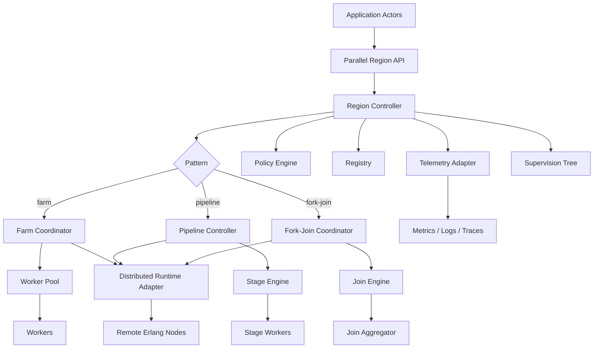
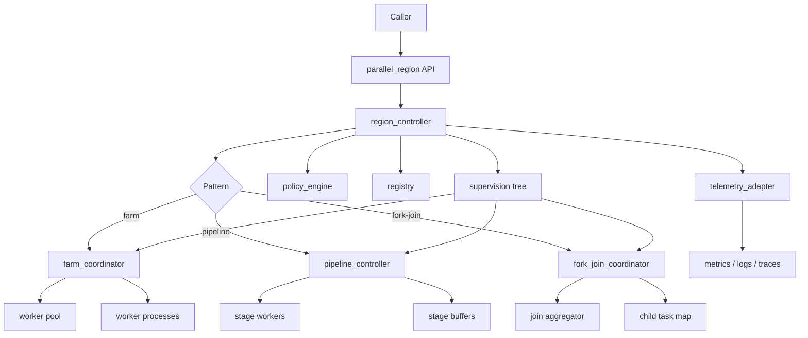
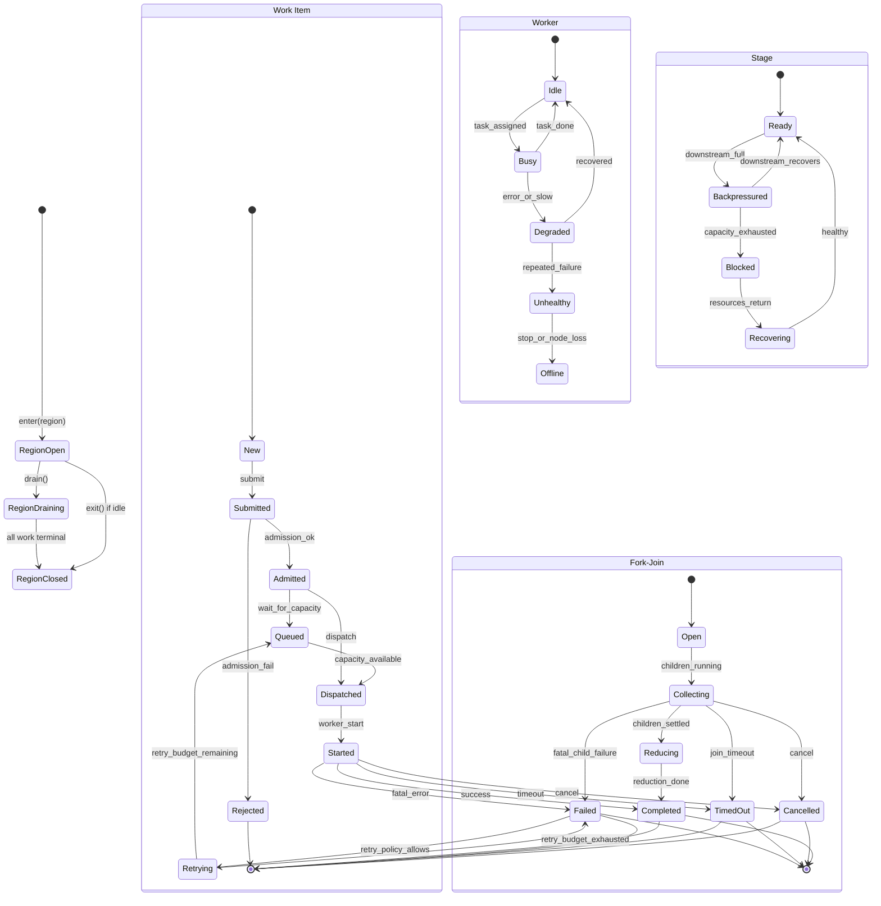
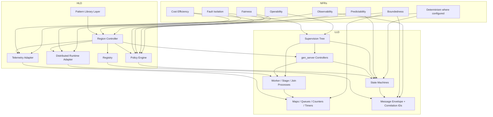

# Erlang Parallel Patterns

Erlang actor-based orchestration libraries:

- `farm`
- `pipeline`
- `fork-join`

Standard Erlang processes handle execution; distributed Erlang handles transport and placement.

## 1. Functional Requirements

- Accepts work from Erlang actors and routes it through exactly one of the supported patterns: `farm`, `pipeline`, or `fork-join`.
- Supports a scoped parallel-region model with explicit lifecycle operations: `enter`, `submit`, `wait`, `cancel`, `drain`, `exit`.
- Accepts work only inside an open region and rejects work that arrives after drain or close.
- Submits, queues, dispatches, executes, collects, retries, cancels, and completes work with explicit terminal states.
- Correlates every request, child task, retry attempt, response, failure, timeout, and cancellation using stable IDs.
- Enforces bounded inflight work and bounded queues at every layer: region, coordinator, stage, worker pool, and join boundary.
- Applies backpressure and admission control when capacity, budget, quota, or policy limits are exceeded.
- Supports ordering only when explicitly requested and preserves unordered execution as the default path.
- Supports partial results where the pattern and policy permit them.
- Supports retries with explicit retry budgets and classifies retryable vs non-retryable failures.
- Supports failure propagation policies: `fail-fast`, `retry`, `skip`, `isolate`.
- Supports timeouts at work, stage, job, join, and region-drain level.
- Supports aggregation and reduction for fork-join workloads with bounded fan-out.
- Supports stage composition and stage-level concurrency for pipelines.
- Supports worker-pool dispatch for farms with load-aware selection.
- Runs on top of a separate distributed runtime layer that handles placement, transport, and node health.
- Exposes metrics, logs, and traces for each work lifecycle and every terminal transition.

## 2. Non-Functional Requirements

### 2.1 Qualities

- **Boundedness**: every queue, mailbox-facing buffer, inflight set, retry budget, and fan-out set has a finite configured maximum.
- **Predictability**: the system degrades in measurable steps under pressure rather than failing abruptly or silently.
- **Fault isolation**: a worker, stage, coordinator, node, or tenant failure remains localized unless policy explicitly escalates it.
- **Observability**: every admitted work item produces traceable lifecycle events, metrics, and final settlement.
- **Fairness**: sustained load does not allow one tenant, region, or job class to monopolize the system indefinitely.
- **Cost efficiency**: orchestration overhead remains a bounded fraction of useful work, even when the system is under contention.
- **Deterministic semantics where configured**: if ordering, retry, or failure propagation is configured deterministically, the runtime preserves that contract.
- **Operability**: operators can inspect, drain, reject, scale, and recover the runtime without guesswork.

### 2.2 Quantification

- **Utilization ratio**: `rho = lambda / (c * mu)`
  - `lambda`: arrival rate
  - `c`: effective worker count
  - `mu`: mean service rate per worker
  - Target operating band: `rho < 0.7`
  - Tighter upper band: `rho < 0.8`

- **Latency decomposition**
  - `submit_to_admit`
  - `admit_to_start`
  - `start_to_complete`
  - `submit_to_complete`
  - Report `p50`, `p95`, and `p99` for each.
  - Queueing delay is reported separately from execution time.

- **Queue dynamics**
  - `queue_depth`
  - `queue_growth_rate = d(queue_depth) / dt`
  - `queue_age_p95`
  - `queue_age_p99`
  - Steady-state expectation: `queue_growth_rate <= 0`

- **Retry behavior**
  - `retry_rate`
  - `retry_amplification = total_attempts / unique_tasks`
  - `retry_exhaustion_rate`
  - Typical target: retry amplification near `1.x`
  - Controlled recovery ceiling: stays below `2x` except in explicitly degraded modes

- **Admission behavior**
  - `admission_rate`
  - `defer_rate`
  - `reject_rate`
  - `reject_reason_distribution`
  - Rejections are explicit and measurable, not implicit drops.

- **Completion behavior**
  - `completion_rate`
  - `timeout_rate`
  - `cancel_rate`
  - `failure_rate`
  - Every submitted unit ends in exactly one terminal state.

- **Overhead**
  - `coordination_overhead_pct`
  - `telemetry_overhead_pct`
  - `remote_dispatch_ratio`
  - `orchestration_overhead_pct`
  - For meaningful workloads, orchestration overhead stays in the single-digit percent range where feasible.

### 2.3 Constraints

- **`Qmax`**: maximum queue depth per coordinator, stage, and worker-facing buffer.
- **`Imax`**: maximum inflight work per region or coordination scope.
- **`Rmax`**: maximum retries per work item or job.
- **`Tmax`**: maximum timeout allowed for work, stage, job, or join scopes.
- **`Mmax`**: maximum message size accepted across process or node boundaries.
- **`Fmax`**: maximum fan-out and fan-in allowed by a fork-join job.
- **`Smax`**: maximum stage buffer capacity per pipeline stage.

- when a limit is reached, the runtime `rejects`, `defers`, or applies backpressure
- no hidden buffer grows without a configured ceiling
- no retry loop continues past its budget
- no remote dispatch bypasses local admission checks

### 2.4 Scale

- Per-process state is `O(1)` where possible.
- Per-region state is `O(n)` for live jobs, where `n` is the number of active jobs or tasks in scope.
- Farm submission and dispatch is `O(1)` average, or `O(log k)` if using load-based worker selection over `k` candidates.
- Pipeline stage hop should be `O(1)` per item per hop.
- Fork-join tracking should be linear in the number of children, with no hidden quadratic scans.
- Cluster scale grows with worker capacity and node count, not with coordinator complexity.
- Coordinator state remains bounded by configured live-work limits, not by external demand.

### 2.5 Reality Constraints and Non-Goals

#### Reality constraints

- **Single-node correctness first**: local region lifecycle, bounded queues, retries, cancellation, and terminal settlement work correctly on one node before distribution is treated as production-ready.
- **Best-effort distribution, not distributed consensus**: distributed Erlang provides transport and process reachability; it does not provide global transaction semantics, consensus, or automatic split-brain repair.
- **No exactly-once illusion**: the runtime assumes duplicate submissions, duplicate completions, and late arrivals can happen and classifies them safely.
- **No unbounded replay**: retries are budgeted and finite; recovery does not turn into infinite re-execution.
- **No global ordering by default**: ordering is opt-in and local to the scope that requested it.
- **No unbounded telemetry**: tracing and logging are sampled or bounded so observability does not become a secondary failure source.
- **No coordinator omniscience**: admission and placement decisions come from local state, bounded registry data, and health hints, not from a fantasy of perfect global visibility.
- **No semantic dependence on node identity**: nodes are execution targets and failure domains, not the owners of business semantics.
- **No hidden durable queueing layer**: if durability is needed later, it is introduced as an explicit storage subsystem, not smuggled into coordinator mailboxes.
- **No claim of perfect fairness**: fairness is approximated with quotas, priorities, and starvation detection, not promised as a mathematical guarantee.

#### Non-goals for v1

- Distributed consensus across all coordinators.
- Exactly-once delivery or exactly-once execution semantics.
- Cross-node total ordering as a default mode.
- Durable write-ahead recovery for every lifecycle event.
- Automatic healing of network partitions without operator involvement.
- Unlimited fan-out, fan-in, or buffering.
- Observability that captures every event at full fidelity under all loads.
- A general-purpose workflow engine that supports arbitrary business process semantics.
- A replacement for Erlang/OTP supervision or distributed Erlang itself.

#### Practical operating stance

- Prefer **reject or defer** over accepting work the system cannot settle safely.
- Prefer **bounded lossless behavior** over unbounded buffering.
- Prefer **local containment** over cluster-wide recovery magic.
- Prefer **explicit operational intervention** over pretending the runtime can self-correct every failure mode.
- Prefer **measurable degradation** over hidden overload.

```mermaid
flowchart TB
  A["Qualities"] --> B["Boundedness"]
  A --> C["Predictability"]
  A --> D["Fault Isolation"]
  A --> E["Observability"]
  A --> F["Fairness"]
  A --> G["Cost Efficiency"]
  A --> H["Determinism"]
  A --> I["Operability"]

  J["Quantification"] --> K["Utilization rho"]
  J --> L["Latency decomposition"]
  J --> M["Queue dynamics"]
  J --> N["Retry behavior"]
  J --> O["Admission behavior"]
  J --> P["Completion behavior"]
  J --> Q["Overhead"]

  R["Constraints"] --> S["Qmax"]
  R --> T["Imax"]
  R --> U["Rmax"]
  R --> V["Tmax"]
  R --> W["Mmax"]
  R --> X["Fmax"]
  R --> Y["Smax"]

  Z["Scale"] --> AA["O(1) per process where possible"]
  Z --> AB["O(n) per region for live jobs"]
  Z --> AC["O(1) average farm dispatch"]
  Z --> AD["O(1) pipeline hop"]
  Z --> AE["Linear fork-join child tracking"]
  Z --> AF["Cluster scale tracks worker capacity"]
```

## 3. Core Entities

- `WorkItem`: a single executable unit with payload, deadline, priority, retry budget, and correlation IDs.
- `Job`: a logical request that may own one or many work items and one terminal outcome.
- `ParallelRegion`: a scoped execution envelope that contains admission, coordination, and lifecycle boundaries.
- `Worker`: an Erlang process that executes admitted work and returns a terminal result, failure, or timeout.
- `Coordinator`: the process that routes, tracks, retries, and settles work for one region or pattern.
- `Stage`: a pipeline step with its own queue, concurrency limit, and downstream capacity view.
- `Result`: a successful terminal output, possibly partial depending on policy.
- `Failure`: a classified terminal error that carries reason, scope, and retry eligibility.
- `Policy`: the combined routing, retry, timeout, ordering, and overload rule set.
- `Budget`: the finite allowance for time, compute, retries, queue usage, or fan-out.
- `Credit`: an admission token representing available capacity or permission to proceed.
- `CostModel`: the estimator used to compare expected cost against expected value or priority.
- `Quota`: a per-tenant, per-job-class, or per-region cap on consumption.
- `BackpressureState`: the current signal that downstream or upstream capacity is constrained.
- `Telemetry`: the set of counters, histograms, spans, and structured events emitted by the runtime.
- `RejectionReason`: the classified reason a work item was not admitted, including `capacity`, `budget`, `policy`, `timeout`, `overload`, and `invalid_input`.

## 4. Data Flows

### Farm flow
- Caller enters a region and submits independent work items.
- The region controller performs admission checks against queue depth, inflight count, quota, and deadline.
- The farm coordinator selects a worker using the configured dispatch policy.
- The worker executes the task and returns a terminal outcome.
- The coordinator correlates the outcome, updates inflight and queue state, and emits lifecycle telemetry.

### Pipeline flow
- Input enters the first stage as a bounded item or batch.
- Each stage transforms, validates, enriches, filters, or aggregates the payload.
- Each stage has its own queue, concurrency limit, and downstream capacity view.
- If downstream capacity is exhausted, backpressure propagates upstream instead of allowing unbounded buffering.
- Final stage completion closes the pipeline item or emits a partial result if policy allows it.

### Fork-join flow
- A parent job is admitted into a bounded region.
- The coordinator splits the parent into a finite child set.
- Child tasks are dispatched independently and tracked by parent correlation ID.
- Join logic waits for the required child settlement set.
- The reducer combines settled results and produces the parent outcome, or terminates early on policy-defined failure.

### Common control flow
- submit
- estimate cost
- check capacity and budget
- admit / queue / defer / reject
- execute
- measure actual cost
- update telemetry
- emit terminal state
- reconcile late or duplicate arrivals

## 5. High-Level Design

- **Pattern library layer**: exposes `farm`, `pipeline`, and `fork-join` as reusable orchestration semantics.
- **Region controller**: owns one region lifecycle, admission envelope, and final settlement boundary.
- **Worker pool**: holds a finite set of execution workers and exposes their health and capacity.
- **Stage engine**: manages stage graphs, stage queues, stage credits, and downstream pressure propagation.
- **Join engine**: tracks fork-join child completion, countdown state, and reduction completion.
- **Policy engine**: applies retry, timeout, quota, ordering, and overload policy decisions.
- **Registry**: correlates jobs, work items, child tasks, retries, node refs, and terminal outcomes.
- **Telemetry adapter**: emits metrics, logs, spans, and counters for lifecycle and health.
- **Distributed runtime adapter**: handles node discovery, transport, remote placement, and node-level health.
- **Deployment plane**: hosts the runtime on one node or many nodes without changing library semantics.

## 6. Low-Level Design

### 6.1 Process Model

- `region_controller` as `gen_server`: owns the region lifecycle, terminal state, and admission boundary.
- `farm_coordinator` as `gen_server`: manages farm dispatch, inflight tracking, and optional ordering.
- `pipeline_controller` as `gen_server`: manages stage routing, credit propagation, and backpressure.
- `fork_join_coordinator` as `gen_server`: manages split/join state, child maps, and reduction boundaries.
- worker processes: execute payloads only and do not own coordination policy.
- stage worker processes: execute stage transforms and forward bounded outputs.
- join aggregator: settles child completion and performs join classification.
- registry process: stores correlation and settlement lookup state.
- telemetry adapter: emits operational signals without altering control flow.

### 6.2 Supervision Tree

- top supervisor
- region supervisor
- worker supervisor
- stage supervisor
- join supervisor
- registry supervisor
- telemetry supervisor

- restart containment at the worker or stage layer
- region-local recovery without global restart storms
- explicit drain behavior before shutdown or rollout
- bounded restart policy so repeated failure cannot create infinite churn

### 6.3 State Layout

- **Region state**: region ID, pattern, policy, limits, inflight count, queue depth, active jobs, drain flag, cancel flag, terminal state.
- **Farm state**: worker list, worker load map, pending queue, inflight map, optional reorder buffer, next sequence number.
- **Pipeline state**: stage list, stage queues, stage inflight map, stage credits, downstream capacity map, stage health map.
- **Fork-join state**: parent job map, child task map, countdown map, accumulator map, join timeout map.

### 6.4 Messaging

- `submit`
- `admit`
- `dispatch`
- `start`
- `done`
- `fail`
- `cancel`
- `timeout`
- `retry`
- `drain`
- `exit`
- late-result notice
- duplicate-result notice
- node-down notice
- recovery notice

Every message preserves:
- region ID
- job ID
- task ID
- parent ID where relevant
- stage ID where relevant
- attempt number
- trace ID

### 6.5 State Machine

- Work item state machine.
- Region state machine.
- Worker state machine.
- Stage state machine.
- Fork-join join state machine.

The lifecycle contract is:
- one owner per state machine
- one terminal state per work item
- terminal states are absorbing
- timeout and cancellation are terminal, not advisory
- retry is a transition, not a side effect
- late arrivals after terminal settlement are classified and ignored safely

### 6.6 DSA / Lifecycle Model

- Maps for correlation and registry lookup.
- Queues for pending work and stage buffering.
- Counters for inflight, retry count, and active child count.
- Timers for deadlines and join timeouts.
- Monitor refs for worker and node liveness.
- Ordered buffers only when ordering is explicitly enabled.

Algorithmic expectations:
- region admission should be constant-time on average
- task lookup should be constant-time on average
- join bookkeeping should be linear in child count
- fan-out and fan-in must never exceed configured limits
- no steady-path scan should require full coordinator-state traversal

## 7. Deep-Dived Design

- The same region contract governs all three patterns, so the caller gets a uniform lifecycle model.
- Arbitrary Erlang payloads remain opaque, but the control envelope stays typed, bounded, and validated.
- Farm, pipeline, and fork-join differ in topology, but they share the same terminal-state and admission rules.
- Distributed Erlang is used for message transport and placement, not for redefining pattern semantics.
- Every transition is explicit, idempotent, and traceable.
- Backpressure is the preferred failure response until policy says rejection is required.
- Timeouts, retries, cancellations, and late arrivals are normal lifecycle events, not exceptional edge cases.
- Observability must capture queue delay and execution time separately so contention can be diagnosed, not guessed.

## 8. Economic Model

- Treat every submitted work item as a bounded cost object.
- Account for execution cost, coordination cost, queueing cost, retry cost, remote cost, and observability cost.
- Admit only when expected value exceeds expected cost under the active policy and budget.
- Keep retry amplification bounded because retries are load multipliers, not free recovery.
- Prefer local execution when the local node has capacity and the remote premium is not justified.
- Prefer rejection or deferral to uncontrolled queue growth.
- Use policy to decide whether ordering, retries, or remote placement are worth the extra cost.
- Ensure orchestration overhead stays a small fraction of meaningful work, or the library becomes the workload instead of serving it.

## 9. Deployment Approach

- Start on a single Erlang node to validate semantics, state transitions, and boundedness.
- Extend to distributed Erlang only after local lifecycle correctness is stable.
- Use node-level worker placement to spread MIMD execution across cores and hosts.
- Keep library semantics separate from runtime transport so deployment does not change behavior.
- Use OTEL for tracing and Jaeger as the trace backend.
- Use metrics and logs alongside traces; do not rely on tracing alone.
- If deployed on Kubernetes or GKE, treat workers, coordinators, and telemetry as distinct operational surfaces.
- Make config, secrets, drain, rollout, and health checks first-class operational capabilities.
- Preserve a graceful shutdown path so active regions can drain without losing terminal correctness.

## 10. Adversarial Review
Primary risks:
- overload and admission collapse
- fairness collapse under noisy-neighbor conditions
- retry storms that amplify demand instead of reducing it
- mailbox growth on coordinators and workers
- scheduler pressure and tail latency spikes
- node failure and remote work reclassification
- late results arriving after timeout or cancel
- duplicate settlement and replay ambiguity
- telemetry overload becoming a secondary failure source

Operational controls:
- runbooks for queue growth, worker failure, node loss, retry storms, drain, and rollout
- alerts on queue depth, queue growth rate, rejection rate, retry amplification, timeout rate, and tail latency
- bounded restart policy to prevent supervision churn
- explicit admission thresholds and per-tenant quotas
- safe drain and hard-stop behavior
- health checks for region controllers, workers, stages, and join coordinators

Edge preservation:
- no silent drop
- no unbounded state growth
- no uncontrolled retry loop
- no unobserved terminal state
- no remote bypass of admission or budget rules
- no policy path that turns overload into silent corruption
