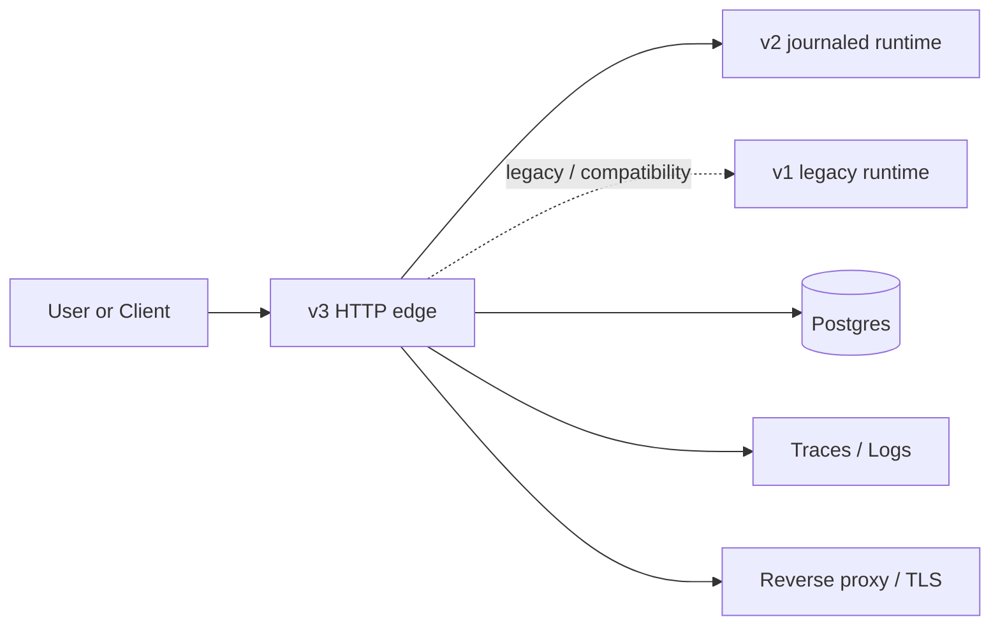

# Workflow Engine

Versioned workflow engine for practical public use.

## What We Built

- `v1`: legacy baseline kept intact for compatibility and regression checks.
- `v2`: production-shaped runtime with journaled commits, replayable projections, and durable state in the live path.
- `v3`: live HTTP edge with auth, rate limiting, tracing, execution logging, and public-front-door wiring.

## Production Reality

- Public traffic should enter through `v3`.
- `v2` is the production path; `v1` remains legacy.
- Public deployments are expected to use:
  - HTTPS through the reverse proxy front door
  - a required API key
  - shared rate limiting
  - Postgres-backed workflow state and execution logs
  - OTel traces for execution visibility
- `v3` exposes an ops snapshot for basic SLI monitoring.

## SLO / SLA / SLI

- **SLI**: request success rate, client error rate, server error rate, auth failures, rate-limit hits, overload hits, and request latency percentiles.
- **SLO**: target `99.9%` availability, `p95 <= 250ms`, `p99 <= 750ms` for the live request path under normal load.
- **SLA**: service is provided on a best-effort commercial basis for the deployed environment, with the above SLOs as the operational goal rather than a hard warranty.
- The ops snapshot is exposed from `v3` so operators can inspect the current SLI state without pulling raw logs.

## Constraints

- Specs, inputs, and effect targets are untrusted.
- Guards are bounded and deterministic.
- Effects are not executed inline with ingress.
- File-backed stores are local/legacy support, not the public durability layer.
- Public auth is fail-closed when the API key is missing.

## Operational Risk

- The public deployment is still intentionally simple.
- The codebase favors clarity and bounded behavior over speculative abstraction.
- The main remaining risk is operational scale, not core shape.
- The public edge is safer now, but like any live service it still depends on correct secrets, TLS, database availability, and deployment hygiene.

## Status

- TypeScript checks pass.
- Tests pass.
- Compose is available for local and integration use.
- GCP bootstrap is present for deployment.

## Docs

- [v1](docs/v1.md)
- [v2](docs/v2.md)
- [v3](docs/v3.md)
- [Tests](docs/tests.md)
