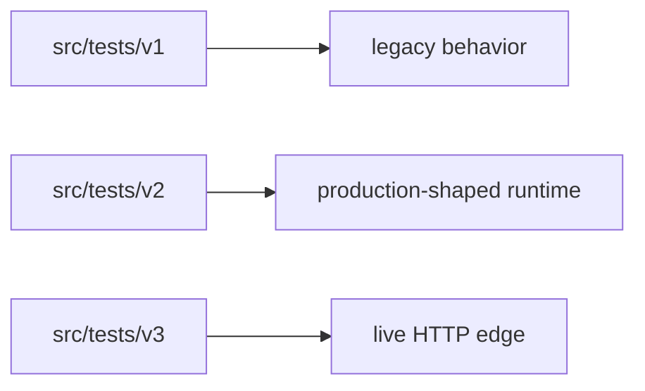

# Tests

## Suite Layout

- [`src/tests/v1/index.test.ts`](/Users/settoramediku/Documents/Github/kofi-ska/swe-projects/workflow-engine/src/tests/v1/index.test.ts)
- [`src/tests/v2/index.test.ts`](/Users/settoramediku/Documents/Github/kofi-ska/swe-projects/workflow-engine/src/tests/v2/index.test.ts)
- [`src/tests/v3/index.test.ts`](/Users/settoramediku/Documents/Github/kofi-ska/swe-projects/workflow-engine/src/tests/v3/index.test.ts)

## What They Prove

- `v1` locks legacy behavior in place.
- `v2` proves journaled commit semantics, replay behavior, and durable-state handling.
- `v3` proves the live facade, tracing, and authorization gate.

## Current Coverage

- Validation failures and success cases.
- Guard limits and payload limits.
- Commit, dedupe, append-failure, and spec-mismatch behavior.
- Trace export smoke test.
- API-key authorization behavior.
- Ops snapshot shape for SLI monitoring.

## How To Run

- `npm test`
- `npx tsc --noEmit`
