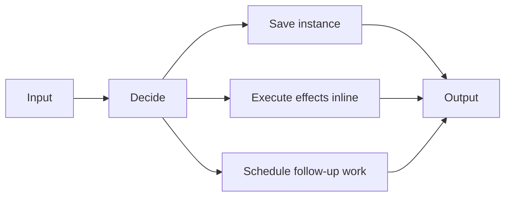

# v1

## What It Is

Legacy workflow engine. Kept as the original baseline and compatibility reference.

## Constraints

- File-backed runtime.
- Inline effect execution in the legacy path.
- Separate save/history steps rather than one durable commit bundle.
- Not the public production path.

## Operational Reality

- Useful for comparisons, regression tests, and local legacy flows.
- Should not be the default target for new public traffic.
- Kept intact so v2 and v3 can be judged against a stable baseline.

## Tests

- [`src/tests/v1/index.test.ts`](/Users/settoramediku/Documents/Github/kofi-ska/swe-projects/workflow-engine/src/tests/v1/index.test.ts)
- Covers validation, decisioning, payload limits, idempotency, spec mismatch, guard limits, scheduler behavior, and save-failure behavior.
