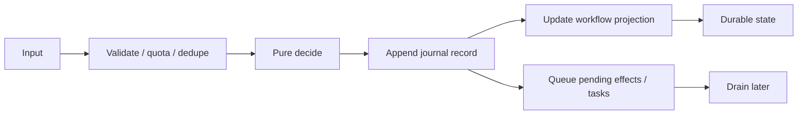

# v2

## What It Is

The production-shaped workflow engine. It uses journaled commits and replayable projections.

## Constraints

- Bounded pure decision core.
- Append-only journal semantics.
- Durable workflow snapshot state in the live path.
- Pending effects and tasks are data, not inline side effects.
- Version checks reject stale writes instead of silently merging them.

## Operational Reality

- This is the version the public service should favor.
- File-backed adapters remain for local/dev parity.
- In the live path, v2 uses Postgres-backed state and journal tables.
- The runtime is simpler than v1, but materially safer for live use.

## Tests

- [`src/tests/v2/index.test.ts`](/Users/settoramediku/Documents/Github/kofi-ska/swe-projects/workflow-engine/src/tests/v2/index.test.ts)
- Covers validation, decisioning, payload limits, journal commit behavior, replay, spec mismatch, disallowed effects, and store append failure handling.
