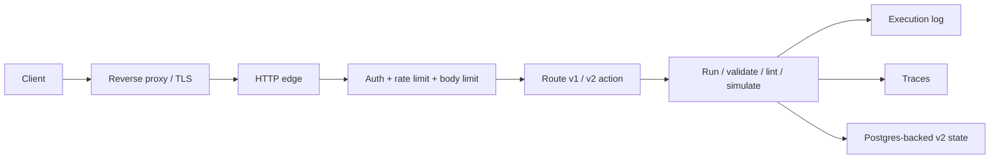

# v3

## What It Is

The live HTTP edge. It exposes versioned workflow operations and wraps the engine with operational controls.

## Constraints

- Public traffic goes through the reverse proxy front door.
- API key auth is required for public use.
- Concurrency limits and request limits are enforced.
- Traces and execution logs are emitted for each request.
- `v1` HTTP is disabled by default; `v2` is the public production path.

## SLO / SLA / SLI

- **SLI**
  - request success rate
  - client error rate
  - server error rate
  - unauthorized request count
  - rate-limited request count
  - overload request count
  - request latency average, p50, p95, p99, and max
- **SLO**
  - `99.9%` availability
  - `p95 <= 250ms`
  - `p99 <= 750ms`
  - `0%` duplicate commits for the same event ID
  - `0%` duplicate effect execution for acked work
- **SLA**
  - public service is offered on the deployed environment with the above SLOs as the operating target
  - outages caused by invalid configuration, missing secrets, or infrastructure failure remain operational risk unless separately contracted

## Operational Reality

- `v3` is the user-facing layer.
- It should stay thin.
- It should not own business logic beyond routing, policy, and enforcement.
- Its main job is to make the engine safe to expose publicly.
- The live ops snapshot is available at `GET /ops`.

## Tests

- [`src/tests/v3/index.test.ts`](/Users/settoramediku/Documents/Github/kofi-ska/swe-projects/workflow-engine/src/tests/v3/index.test.ts)
- Covers versioned validation, simulation, runtime commit, trace export, API-key authorization behavior, and ops snapshot fields.
